# SYSPCC — Diagramas de Casos de Uso

**Sistema de Gestión de Requerimientos de Abastecimiento**
**Versión:** 1.0 | **Fecha:** Abril 2026 | **Empresa:** PCC Ingeniería y Construcción

---

## 1. Diagrama General — Todos los Módulos

```mermaid
graph TB
    subgraph Actores
        REQ[👤 Solicitante<br/>REQUESTER]
        PR[👤 Residente de Proyecto<br/>PROJECT_RESIDENT]
        PC[👤 Control de Proyecto<br/>PROJECT_CONTROL]
        GM[👤 Gerente General<br/>GENERAL_MANAGER]
        LC[👤 Coordinador Logístico<br/>LOGISTICS_COORDINATOR]
        CW[👤 Almacén Central<br/>CENTRAL_WAREHOUSE]
        SW[👤 Almacén de Obra<br/>SITE_WAREHOUSE]
        DS[👤 Jefe Directo<br/>DIRECT_SUPERVISOR]
        AM[👤 Gerente Administrativo<br/>ADMIN_MANAGER]
        LS[👤 Supervisor Logístico<br/>LOGISTICS_SUPERVISOR]
        LCH[👤 Jefe Logístico<br/>LOGISTICS_CHIEF]
    end

    subgraph "Módulo RQ"
        UC1((Crear RQ))
        UC2((Enviar RQ))
        UC3((Aprobar/Rechazar))
        UC4((Gestionar Cotizaciones))
        UC5((Generar OC))
        UC6((Control de Calidad))
        UC7((Cerrar RQ))
    end

    subgraph "Módulo Almacén"
        UC8((Registrar Entrada))
        UC9((Registrar Salida))
        UC10((Consultar Kardex))
        UC11((Transferir Stock))
    end

    subgraph "Módulo Admin"
        UC12((Gestionar Pasajes))
        UC13((Configurar Políticas))
    end

    subgraph "Módulo Soporte"
        UC14((Crear Ticket))
        UC15((Gestionar Ticket))
    end

    REQ --> UC1
    REQ --> UC2
    REQ --> UC7
    REQ --> UC14
    PR --> UC3
    PC --> UC3
    GM --> UC3
    DS --> UC3
    AM --> UC3
    LC --> UC4
    LC --> UC5
    LC --> UC6
    LS --> UC4
    LCH --> UC4
    CW --> UC8
    CW --> UC9
    CW --> UC10
    CW --> UC11
    SW --> UC10
    SW --> UC11
    AM --> UC12
    AM --> UC13
    GM --> UC15
```

---

## 2. Casos de Uso — Módulo de Requerimientos (RQ)

### 2.1 Diagrama de Casos de Uso del Módulo RQ

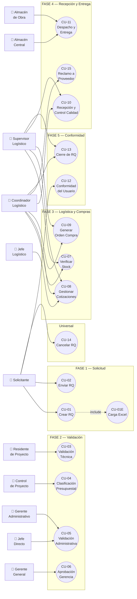
```mermaid
graph LR
    REQ[👤 Solicitante]
    PR[👤 Residente<br/>de Proyecto]
    PC[👤 Control<br/>de Proyecto]
    GM[👤 Gerente<br/>General]
    DS[👤 Jefe<br/>Directo]
    AM[👤 Gerente<br/>Administrativo]
    LC[👤 Coordinador<br/>Logístico]
    LS[👤 Supervisor<br/>Logístico]
    LCH[👤 Jefe<br/>Logístico]
    CW[👤 Almacén<br/>Central]
    SW[👤 Almacén<br/>de Obra]

    subgraph "FASE 1 — Solicitud"
        CU01((CU-01<br/>Crear RQ))
        CU02((CU-02<br/>Enviar RQ))
        CU01E((CU-01E<br/>Carga Excel))
    end

    subgraph "FASE 2 — Validación"
        CU03((CU-03<br/>Validación<br/>Técnica))
        CU04((CU-04<br/>Clasificación<br/>Presupuestal))
        CU05((CU-05<br/>Validación<br/>Administrativa))
        CU06((CU-06<br/>Aprobación<br/>Gerencia))
    end

    subgraph "FASE 3 — Logística y Compras"
        CU07((CU-07<br/>Verificar<br/>Stock))
        CU08((CU-08<br/>Gestionar<br/>Cotizaciones))
        CU09((CU-09<br/>Generar<br/>Orden Compra))
    end

    subgraph "FASE 4 — Recepción y Entrega"
        CU10((CU-10<br/>Recepción y<br/>Control Calidad))
        CU11((CU-11<br/>Despacho y<br/>Entrega))
        CU15((CU-15<br/>Reclamo a<br/>Proveedor))
    end

    subgraph "FASE 5 — Conformidad"
        CU12((CU-12<br/>Conformidad<br/>del Usuario))
        CU13((CU-13<br/>Cierre de RQ))
    end

    subgraph "Universal"
        CU14((CU-14<br/>Cancelar RQ))
    end

    REQ --> CU01
    REQ --> CU02
    CU01 -.->|include| CU01E
    REQ --> CU12
    REQ --> CU14

    PR --> CU03
    PC --> CU04
    DS --> CU05
    AM --> CU05
    GM --> CU06

    LC --> CU07
    LC --> CU08
    LC --> CU09
    LS --> CU07
    LS --> CU08
    LS --> CU09
    LCH --> CU08

    LC --> CU10
    LC --> CU15
    LS --> CU10
    CW --> CU11
    SW --> CU11

    LC --> CU13
    LS --> CU13
```

### 2.2 Especificación Detallada de Casos de Uso

#### CU-01: Crear Requerimiento

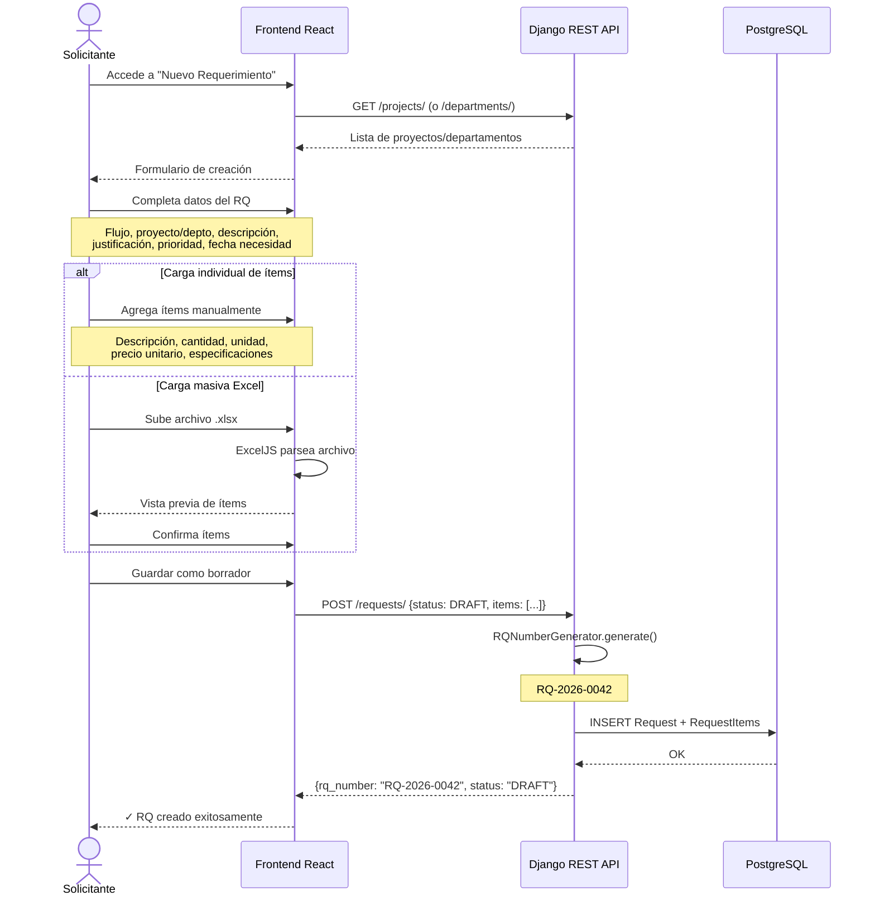
```mermaid
sequenceDiagram
    actor REQ as Solicitante
    participant UI as Frontend React
    participant API as Django REST API
    participant DB as PostgreSQL

    REQ->>UI: Accede a "Nuevo Requerimiento"
    UI->>API: GET /projects/ (o /departments/)
    API-->>UI: Lista de proyectos/departamentos
    UI-->>REQ: Formulario de creación

    REQ->>UI: Completa datos del RQ
    Note over REQ,UI: Flujo, proyecto/depto, descripción,<br/>justificación, prioridad, fecha necesidad

    alt Carga individual de ítems
        REQ->>UI: Agrega ítems manualmente
        Note over REQ,UI: Descripción, cantidad, unidad,<br/>precio unitario, especificaciones
    else Carga masiva Excel
        REQ->>UI: Sube archivo .xlsx
        UI->>UI: ExcelJS parsea archivo
        UI-->>REQ: Vista previa de ítems
        REQ->>UI: Confirma ítems
    end

    REQ->>UI: Guardar como borrador
    UI->>API: POST /requests/ {status: DRAFT, items: [...]}
    API->>API: RQNumberGenerator.generate()
    Note over API: RQ-2026-0042
    API->>DB: INSERT Request + RequestItems
    DB-->>API: OK
    API-->>UI: {rq_number: "RQ-2026-0042", status: "DRAFT"}
    UI-->>REQ: ✓ RQ creado exitosamente
```

| Campo | Detalle |
|-------|---------|
| **ID** | CU-01 |
| **Nombre** | Crear Requerimiento |
| **Actor principal** | Solicitante (REQUESTER) |
| **Precondición** | Usuario autenticado con rol REQUESTER asignado a un proyecto u oficina |
| **Flujo principal** | 1. Selecciona proyecto/departamento 2. Indica flujo (Operaciones/Administrativo) 3. Completa campos: descripción, justificación, prioridad, fecha de necesidad 4. Agrega ítems con descripción, cantidad, unidad, precio unitario 5. Guarda como borrador (DRAFT) |
| **Extensión** | E1: Carga masiva de ítems vía Excel (.xlsx) con ExcelJS |
| **Postcondición** | RQ creado con número auto-generado (RQ-YYYY-NNNN), estado DRAFT |
| **Reglas de negocio** | - Número RQ es secuencial por año - total_price de cada ítem se auto-calcula: quantity × unit_price - Mínimo 1 ítem para poder enviar |

---

#### CU-02: Enviar Requerimiento

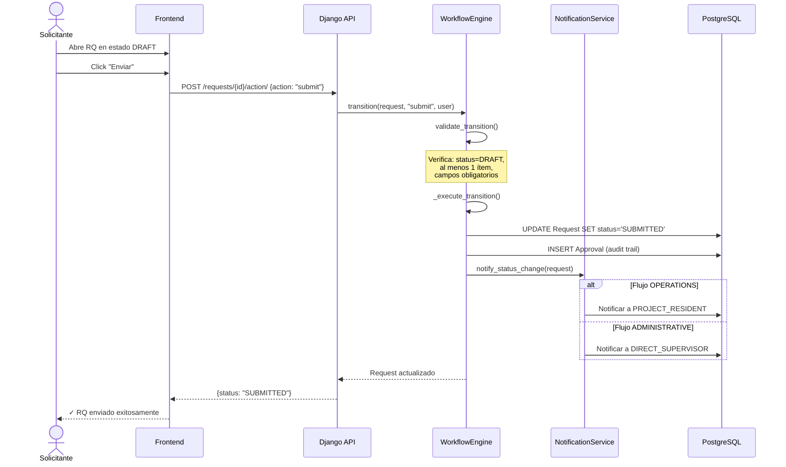
```mermaid
sequenceDiagram
    actor REQ as Solicitante
    participant UI as Frontend
    participant API as Django API
    participant WF as WorkflowEngine
    participant NS as NotificationService
    participant DB as PostgreSQL

    REQ->>UI: Abre RQ en estado DRAFT
    REQ->>UI: Click "Enviar"
    UI->>API: POST /requests/{id}/action/ {action: "submit"}
    API->>WF: transition(request, "submit", user)
    WF->>WF: validate_transition()
    Note over WF: Verifica: status=DRAFT,<br/>al menos 1 ítem,<br/>campos obligatorios
    WF->>WF: _execute_transition()
    WF->>DB: UPDATE Request SET status='SUBMITTED'
    WF->>DB: INSERT Approval (audit trail)
    WF->>NS: notify_status_change(request)

    alt Flujo OPERATIONS
        NS->>DB: Notificar a PROJECT_RESIDENT
    else Flujo ADMINISTRATIVE
        NS->>DB: Notificar a DIRECT_SUPERVISOR
    end

    WF-->>API: Request actualizado
    API-->>UI: {status: "SUBMITTED"}
    UI-->>REQ: ✓ RQ enviado exitosamente
```

| Campo | Detalle |
|-------|---------|
| **ID** | CU-02 |
| **Nombre** | Enviar Requerimiento |
| **Actor principal** | Solicitante (REQUESTER) |
| **Precondición** | RQ en estado DRAFT con al menos 1 ítem |
| **Flujo principal** | 1. Abre RQ en estado DRAFT 2. Revisa ítems y datos 3. Ejecuta acción "Enviar" 4. WorkflowEngine valida y transiciona 5. Estado cambia a SUBMITTED |
| **Postcondición** | RQ en estado SUBMITTED, notificación enviada al siguiente aprobador |

---

#### CU-03: Validación Técnica (Flujo Operaciones)

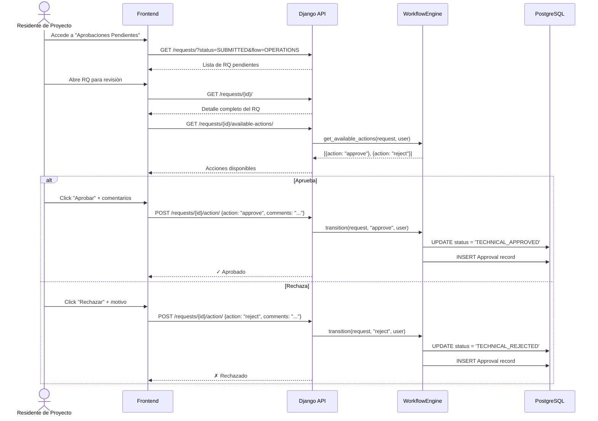
```mermaid
sequenceDiagram
    actor PR as Residente de Proyecto
    participant UI as Frontend
    participant API as Django API
    participant WF as WorkflowEngine
    participant DB as PostgreSQL

    PR->>UI: Accede a "Aprobaciones Pendientes"
    UI->>API: GET /requests/?status=SUBMITTED&flow=OPERATIONS
    API-->>UI: Lista de RQ pendientes
    PR->>UI: Abre RQ para revisión

    UI->>API: GET /requests/{id}/
    API-->>UI: Detalle completo del RQ
    UI->>API: GET /requests/{id}/available-actions/
    API->>WF: get_available_actions(request, user)
    WF-->>API: [{action: "approve"}, {action: "reject"}]
    API-->>UI: Acciones disponibles

    alt Aprueba
        PR->>UI: Click "Aprobar" + comentarios
        UI->>API: POST /requests/{id}/action/ {action: "approve", comments: "..."}
        API->>WF: transition(request, "approve", user)
        WF->>DB: UPDATE status = 'TECHNICAL_APPROVED'
        WF->>DB: INSERT Approval record
        API-->>UI: ✓ Aprobado
    else Rechaza
        PR->>UI: Click "Rechazar" + motivo
        UI->>API: POST /requests/{id}/action/ {action: "reject", comments: "..."}
        API->>WF: transition(request, "reject", user)
        WF->>DB: UPDATE status = 'TECHNICAL_REJECTED'
        WF->>DB: INSERT Approval record
        API-->>UI: ✗ Rechazado
    end
```

| Campo | Detalle |
|-------|---------|
| **ID** | CU-03 |
| **Nombre** | Validación Técnica |
| **Actor principal** | Residente de Proyecto (PROJECT_RESIDENT) |
| **Precondición** | RQ en estado SUBMITTED, flujo OPERATIONS |
| **Flujo principal** | 1. Ve lista de RQ pendientes 2. Revisa ítems y especificaciones 3. Aprueba → TECHNICAL_APPROVED 4. O rechaza con comentarios → TECHNICAL_REJECTED |
| **Postcondición** | RQ aprobado o devuelto al solicitante |

---

#### CU-04: Clasificación Presupuestal

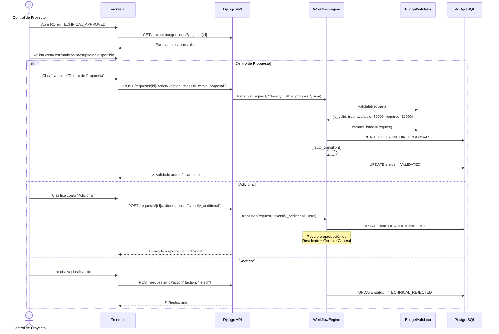
```mermaid
sequenceDiagram
    actor PC as Control de Proyecto
    participant UI as Frontend
    participant API as Django API
    participant WF as WorkflowEngine
    participant BV as BudgetValidator
    participant DB as PostgreSQL

    PC->>UI: Abre RQ en TECHNICAL_APPROVED
    UI->>API: GET /project-budget-lines/?project={id}
    API-->>UI: Partidas presupuestales

    PC->>UI: Revisa costo estimado vs presupuesto disponible

    alt Dentro de Propuesta
        PC->>UI: Clasifica como "Dentro de Propuesta"
        UI->>API: POST /requests/{id}/action/ {action: "classify_within_proposal"}
        API->>WF: transition(request, "classify_within_proposal", user)
        WF->>BV: validate(request)
        BV-->>WF: {is_valid: true, available: 50000, required: 12000}
        WF->>BV: commit_budget(request)
        WF->>DB: UPDATE status = 'WITHIN_PROPOSAL'
        WF->>WF: _auto_transition()
        WF->>DB: UPDATE status = 'VALIDATED'
        API-->>UI: ✓ Validado automáticamente
    else Adicional
        PC->>UI: Clasifica como "Adicional"
        UI->>API: POST /requests/{id}/action/ {action: "classify_additional"}
        API->>WF: transition(request, "classify_additional", user)
        WF->>DB: UPDATE status = 'ADDITIONAL_REQ'
        Note over WF: Requiere aprobación de<br/>Residente + Gerente General
        API-->>UI: Derivado a aprobación adicional
    else Rechaza
        PC->>UI: Rechaza clasificación
        UI->>API: POST /requests/{id}/action/ {action: "reject"}
        WF->>DB: UPDATE status = 'TECHNICAL_REJECTED'
        API-->>UI: ✗ Rechazado
    end
```

| Campo | Detalle |
|-------|---------|
| **ID** | CU-04 |
| **Nombre** | Clasificación Presupuestal |
| **Actor principal** | Control de Proyecto (PROJECT_CONTROL) |
| **Precondición** | RQ en estado TECHNICAL_APPROVED |
| **Flujo principal** | 1. Revisa costo vs partida presupuestal 2. WITHIN_PROPOSAL → VALIDATED (auto) 3. ADDITIONAL_REQ → requiere aprobación Residente + GG |
| **Postcondición** | RQ validado o derivado a aprobación de gerencia |

---

#### CU-05: Validación Administrativa (Flujo Administrativo)

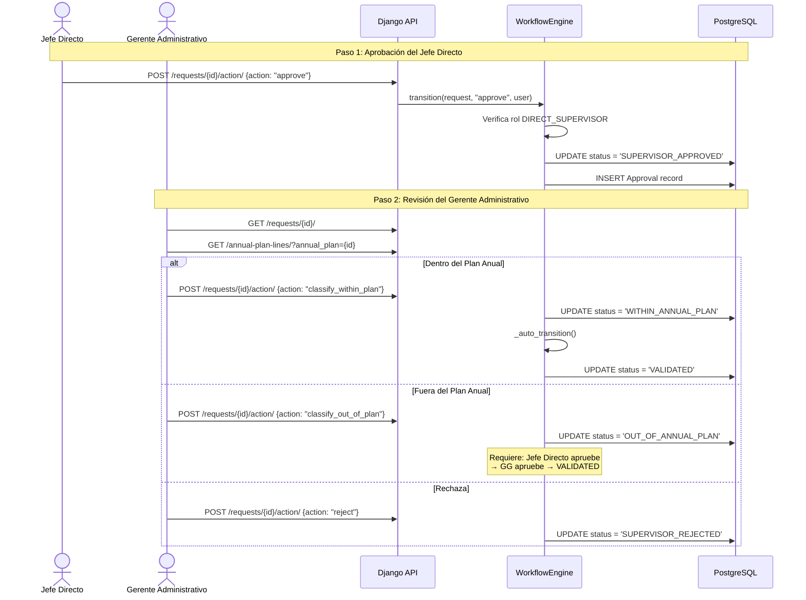
```mermaid
sequenceDiagram
    actor DS as Jefe Directo
    actor AM as Gerente Administrativo
    participant API as Django API
    participant WF as WorkflowEngine
    participant DB as PostgreSQL

    Note over DS,DB: Paso 1: Aprobación del Jefe Directo
    DS->>API: POST /requests/{id}/action/ {action: "approve"}
    API->>WF: transition(request, "approve", user)
    WF->>WF: Verifica rol DIRECT_SUPERVISOR
    WF->>DB: UPDATE status = 'SUPERVISOR_APPROVED'
    WF->>DB: INSERT Approval record

    Note over AM,DB: Paso 2: Revisión del Gerente Administrativo
    AM->>API: GET /requests/{id}/
    AM->>API: GET /annual-plan-lines/?annual_plan={id}

    alt Dentro del Plan Anual
        AM->>API: POST /requests/{id}/action/ {action: "classify_within_plan"}
        WF->>DB: UPDATE status = 'WITHIN_ANNUAL_PLAN'
        WF->>WF: _auto_transition()
        WF->>DB: UPDATE status = 'VALIDATED'
    else Fuera del Plan Anual
        AM->>API: POST /requests/{id}/action/ {action: "classify_out_of_plan"}
        WF->>DB: UPDATE status = 'OUT_OF_ANNUAL_PLAN'
        Note over WF: Requiere: Jefe Directo apruebe<br/>→ GG apruebe → VALIDATED
    else Rechaza
        AM->>API: POST /requests/{id}/action/ {action: "reject"}
        WF->>DB: UPDATE status = 'SUPERVISOR_REJECTED'
    end
```

---

#### CU-06: Aprobación de Gerencia General

| Campo | Detalle |
|-------|---------|
| **ID** | CU-06 |
| **Nombre** | Aprobación de Gerencia General |
| **Actor principal** | Gerente General (GENERAL_MANAGER) |
| **Precondición** | RQ en estado GM_REVIEW (adicional o fuera de plan anual) |
| **Flujo principal** | 1. Ve lista de RQ pendientes de aprobación GG 2. Revisa justificación y montos 3. Aprueba → GM_APPROVED → VALIDATED (auto) 4. O rechaza → GM_REJECTED |
| **Postcondición** | RQ aprobado por gerencia o rechazado definitivamente |

---

#### CU-07 a CU-09: Logística y Compras

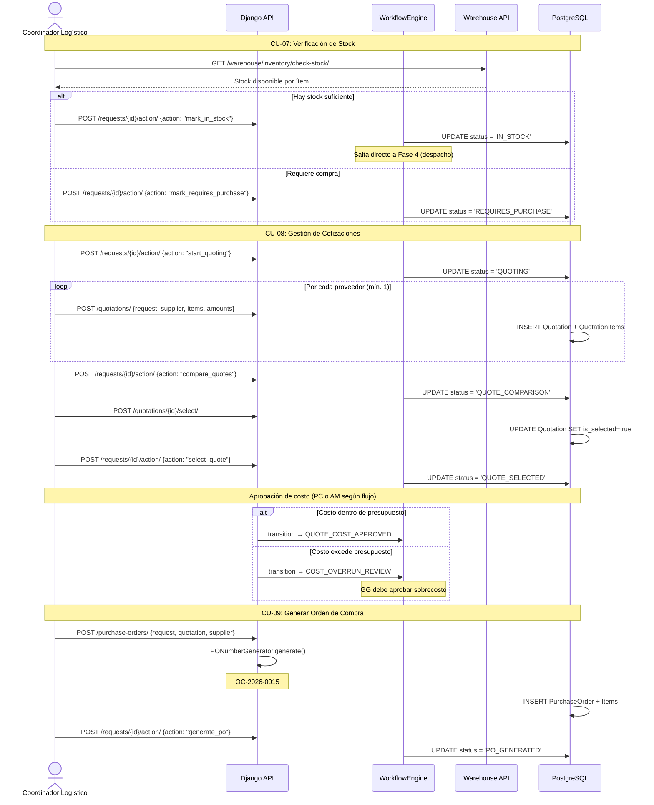
```mermaid
sequenceDiagram
    actor LC as Coordinador Logístico
    participant API as Django API
    participant WF as WorkflowEngine
    participant WH as Warehouse API
    participant DB as PostgreSQL

    Note over LC,DB: CU-07: Verificación de Stock
    LC->>WH: GET /warehouse/inventory/check-stock/
    WH-->>LC: Stock disponible por ítem

    alt Hay stock suficiente
        LC->>API: POST /requests/{id}/action/ {action: "mark_in_stock"}
        WF->>DB: UPDATE status = 'IN_STOCK'
        Note over WF: Salta directo a Fase 4 (despacho)
    else Requiere compra
        LC->>API: POST /requests/{id}/action/ {action: "mark_requires_purchase"}
        WF->>DB: UPDATE status = 'REQUIRES_PURCHASE'
    end

    Note over LC,DB: CU-08: Gestión de Cotizaciones
    LC->>API: POST /requests/{id}/action/ {action: "start_quoting"}
    WF->>DB: UPDATE status = 'QUOTING'

    loop Por cada proveedor (mín. 1)
        LC->>API: POST /quotations/ {request, supplier, items, amounts}
        DB->>DB: INSERT Quotation + QuotationItems
    end

    LC->>API: POST /requests/{id}/action/ {action: "compare_quotes"}
    WF->>DB: UPDATE status = 'QUOTE_COMPARISON'

    LC->>API: POST /quotations/{id}/select/
    DB->>DB: UPDATE Quotation SET is_selected=true
    LC->>API: POST /requests/{id}/action/ {action: "select_quote"}
    WF->>DB: UPDATE status = 'QUOTE_SELECTED'

    Note over LC,DB: Aprobación de costo (PC o AM según flujo)
    alt Costo dentro de presupuesto
        API->>WF: transition → QUOTE_COST_APPROVED
    else Costo excede presupuesto
        API->>WF: transition → COST_OVERRUN_REVIEW
        Note over WF: GG debe aprobar sobrecosto
    end

    Note over LC,DB: CU-09: Generar Orden de Compra
    LC->>API: POST /purchase-orders/ {request, quotation, supplier}
    API->>API: PONumberGenerator.generate()
    Note over API: OC-2026-0015
    DB->>DB: INSERT PurchaseOrder + Items
    LC->>API: POST /requests/{id}/action/ {action: "generate_po"}
    WF->>DB: UPDATE status = 'PO_GENERATED'
```

---

#### CU-10 y CU-11: Recepción y Entrega

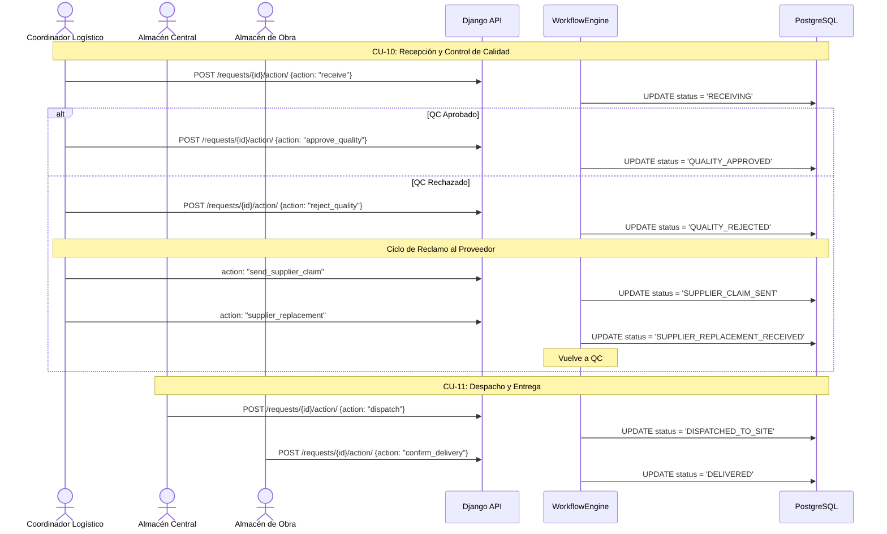
```mermaid
sequenceDiagram
    actor LC as Coordinador Logístico
    actor CW as Almacén Central
    actor SW as Almacén de Obra
    participant API as Django API
    participant WF as WorkflowEngine
    participant DB as PostgreSQL

    Note over LC,DB: CU-10: Recepción y Control de Calidad
    LC->>API: POST /requests/{id}/action/ {action: "receive"}
    WF->>DB: UPDATE status = 'RECEIVING'

    alt QC Aprobado
        LC->>API: POST /requests/{id}/action/ {action: "approve_quality"}
        WF->>DB: UPDATE status = 'QUALITY_APPROVED'
    else QC Rechazado
        LC->>API: POST /requests/{id}/action/ {action: "reject_quality"}
        WF->>DB: UPDATE status = 'QUALITY_REJECTED'

        Note over LC,DB: Ciclo de Reclamo al Proveedor
        LC->>API: action: "send_supplier_claim"
        WF->>DB: UPDATE status = 'SUPPLIER_CLAIM_SENT'
        LC->>API: action: "supplier_replacement"
        WF->>DB: UPDATE status = 'SUPPLIER_REPLACEMENT_RECEIVED'
        Note over WF: Vuelve a QC
    end

    Note over CW,DB: CU-11: Despacho y Entrega
    CW->>API: POST /requests/{id}/action/ {action: "dispatch"}
    WF->>DB: UPDATE status = 'DISPATCHED_TO_SITE'

    SW->>API: POST /requests/{id}/action/ {action: "confirm_delivery"}
    WF->>DB: UPDATE status = 'DELIVERED'
```

---

#### CU-12 y CU-13: Conformidad y Cierre

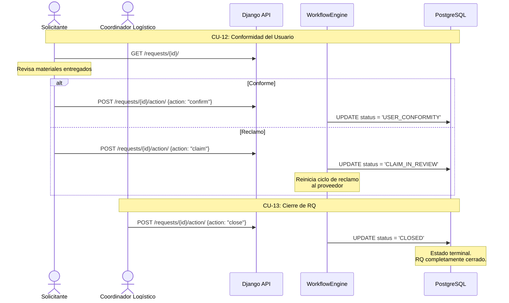
```mermaid
sequenceDiagram
    actor REQ as Solicitante
    actor LC as Coordinador Logístico
    participant API as Django API
    participant WF as WorkflowEngine
    participant DB as PostgreSQL

    Note over REQ,DB: CU-12: Conformidad del Usuario
    REQ->>API: GET /requests/{id}/
    Note over REQ: Revisa materiales entregados

    alt Conforme
        REQ->>API: POST /requests/{id}/action/ {action: "confirm"}
        WF->>DB: UPDATE status = 'USER_CONFORMITY'
    else Reclamo
        REQ->>API: POST /requests/{id}/action/ {action: "claim"}
        WF->>DB: UPDATE status = 'CLAIM_IN_REVIEW'
        Note over WF: Reinicia ciclo de reclamo<br/>al proveedor
    end

    Note over LC,DB: CU-13: Cierre de RQ
    LC->>API: POST /requests/{id}/action/ {action: "close"}
    WF->>DB: UPDATE status = 'CLOSED'
    Note over DB: Estado terminal.<br/>RQ completamente cerrado.
```

---

## 3. Casos de Uso — Módulo de Almacén

### 3.1 Diagrama de Casos de Uso

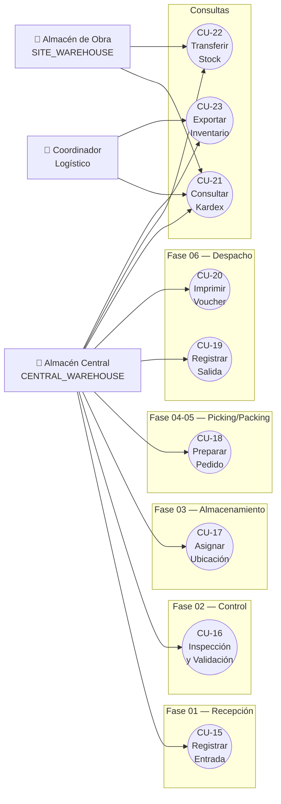
```mermaid
graph LR
    CW[👤 Almacén Central<br/>CENTRAL_WAREHOUSE]
    SW[👤 Almacén de Obra<br/>SITE_WAREHOUSE]
    LC[👤 Coordinador<br/>Logístico]

    subgraph "Fase 01 — Recepción"
        CU15((CU-15<br/>Registrar<br/>Entrada))
    end

    subgraph "Fase 02 — Control"
        CU16((CU-16<br/>Inspección<br/>y Validación))
    end

    subgraph "Fase 03 — Almacenamiento"
        CU17((CU-17<br/>Asignar<br/>Ubicación))
    end

    subgraph "Fase 04-05 — Picking/Packing"
        CU18((CU-18<br/>Preparar<br/>Pedido))
    end

    subgraph "Fase 06 — Despacho"
        CU19((CU-19<br/>Registrar<br/>Salida))
        CU20((CU-20<br/>Imprimir<br/>Voucher))
    end

    subgraph "Consultas"
        CU21((CU-21<br/>Consultar<br/>Kardex))
        CU22((CU-22<br/>Transferir<br/>Stock))
        CU23((CU-23<br/>Exportar<br/>Inventario))
    end

    CW --> CU15
    CW --> CU16
    CW --> CU17
    CW --> CU18
    CW --> CU19
    CW --> CU20
    CW --> CU21
    CW --> CU22
    CW --> CU23

    SW --> CU21
    SW --> CU22

    LC --> CU21
    LC --> CU23
```

### 3.2 Secuencia: Registrar Entrada de Mercadería (CU-15)

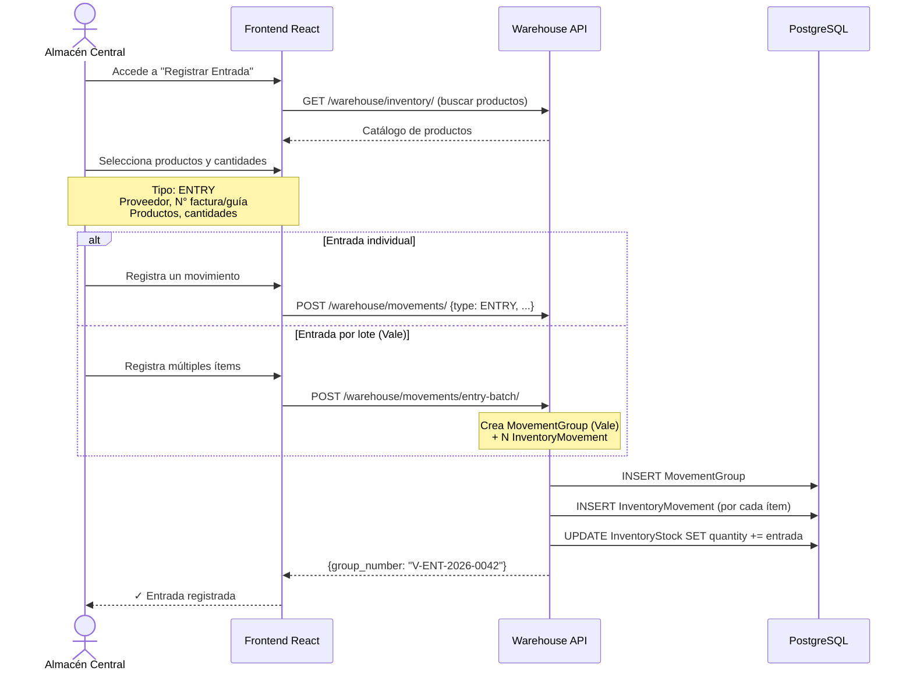
```mermaid
sequenceDiagram
    actor CW as Almacén Central
    participant UI as Frontend React
    participant API as Warehouse API
    participant DB as PostgreSQL

    CW->>UI: Accede a "Registrar Entrada"
    UI->>API: GET /warehouse/inventory/ (buscar productos)
    API-->>UI: Catálogo de productos

    CW->>UI: Selecciona productos y cantidades
    Note over CW,UI: Tipo: ENTRY<br/>Proveedor, N° factura/guía<br/>Productos, cantidades

    alt Entrada individual
        CW->>UI: Registra un movimiento
        UI->>API: POST /warehouse/movements/ {type: ENTRY, ...}
    else Entrada por lote (Vale)
        CW->>UI: Registra múltiples ítems
        UI->>API: POST /warehouse/movements/entry-batch/
        Note over API: Crea MovementGroup (Vale)<br/>+ N InventoryMovement
    end

    API->>DB: INSERT MovementGroup
    API->>DB: INSERT InventoryMovement (por cada ítem)
    API->>DB: UPDATE InventoryStock SET quantity += entrada
    API-->>UI: {group_number: "V-ENT-2026-0042"}
    UI-->>CW: ✓ Entrada registrada
```

### 3.3 Secuencia: Registrar Salida / Despacho (CU-19)

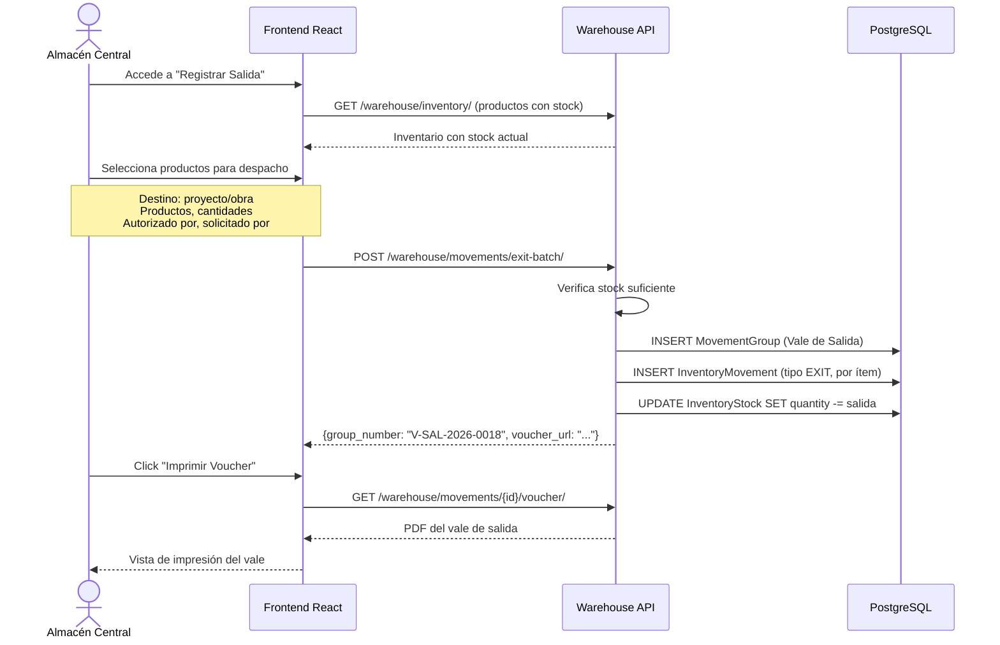
```mermaid
sequenceDiagram
    actor CW as Almacén Central
    participant UI as Frontend React
    participant API as Warehouse API
    participant DB as PostgreSQL

    CW->>UI: Accede a "Registrar Salida"
    UI->>API: GET /warehouse/inventory/ (productos con stock)
    API-->>UI: Inventario con stock actual

    CW->>UI: Selecciona productos para despacho
    Note over CW,UI: Destino: proyecto/obra<br/>Productos, cantidades<br/>Autorizado por, solicitado por

    UI->>API: POST /warehouse/movements/exit-batch/
    API->>API: Verifica stock suficiente
    API->>DB: INSERT MovementGroup (Vale de Salida)
    API->>DB: INSERT InventoryMovement (tipo EXIT, por ítem)
    API->>DB: UPDATE InventoryStock SET quantity -= salida
    API-->>UI: {group_number: "V-SAL-2026-0018", voucher_url: "..."}

    CW->>UI: Click "Imprimir Voucher"
    UI->>API: GET /warehouse/movements/{id}/voucher/
    API-->>UI: PDF del vale de salida
    UI-->>CW: Vista de impresión del vale
```

### 3.4 Secuencia: Consultar Kardex (CU-21)

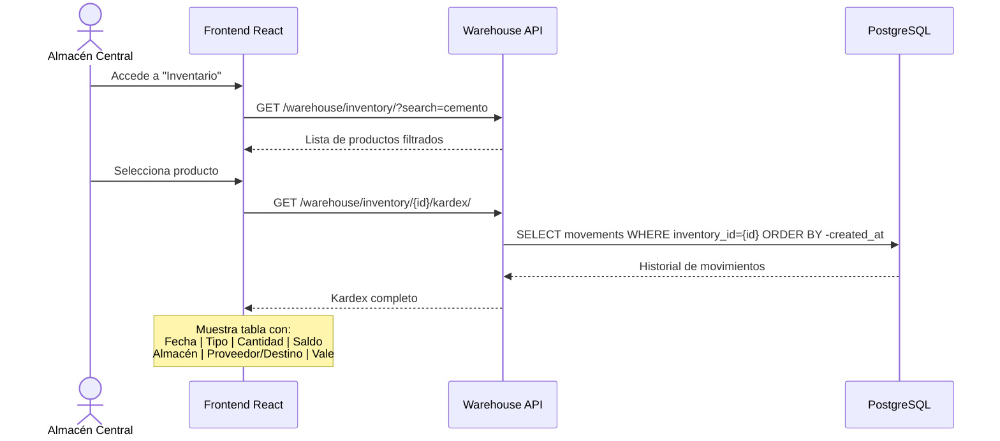
```mermaid
sequenceDiagram
    actor CW as Almacén Central
    participant UI as Frontend React
    participant API as Warehouse API
    participant DB as PostgreSQL

    CW->>UI: Accede a "Inventario"
    UI->>API: GET /warehouse/inventory/?search=cemento
    API-->>UI: Lista de productos filtrados
    CW->>UI: Selecciona producto

    UI->>API: GET /warehouse/inventory/{id}/kardex/
    API->>DB: SELECT movements WHERE inventory_id={id} ORDER BY -created_at
    DB-->>API: Historial de movimientos
    API-->>UI: Kardex completo

    Note over UI: Muestra tabla con:<br/>Fecha | Tipo | Cantidad | Saldo<br/>Almacén | Proveedor/Destino | Vale
```

---

## 4. Casos de Uso — Módulo de Administración

### 4.1 Diagrama de Casos de Uso

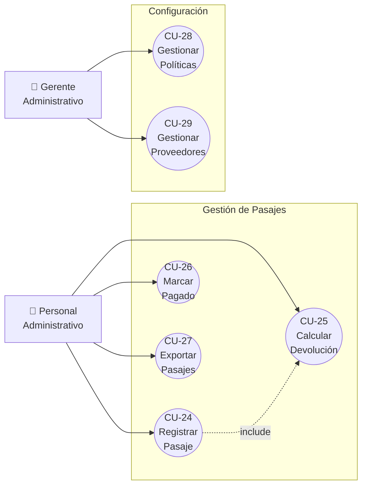
```mermaid
graph LR
    ADM[👤 Personal<br/>Administrativo]
    AM[👤 Gerente<br/>Administrativo]

    subgraph "Gestión de Pasajes"
        CU24((CU-24<br/>Registrar<br/>Pasaje))
        CU25((CU-25<br/>Calcular<br/>Devolución))
        CU26((CU-26<br/>Marcar<br/>Pagado))
        CU27((CU-27<br/>Exportar<br/>Pasajes))
    end

    subgraph "Configuración"
        CU28((CU-28<br/>Gestionar<br/>Políticas))
        CU29((CU-29<br/>Gestionar<br/>Proveedores))
    end

    ADM --> CU24
    ADM --> CU25
    ADM --> CU26
    ADM --> CU27
    AM --> CU28
    AM --> CU29
    CU24 -.->|include| CU25
```

### 4.2 Secuencia: Registrar Pasaje (CU-24)

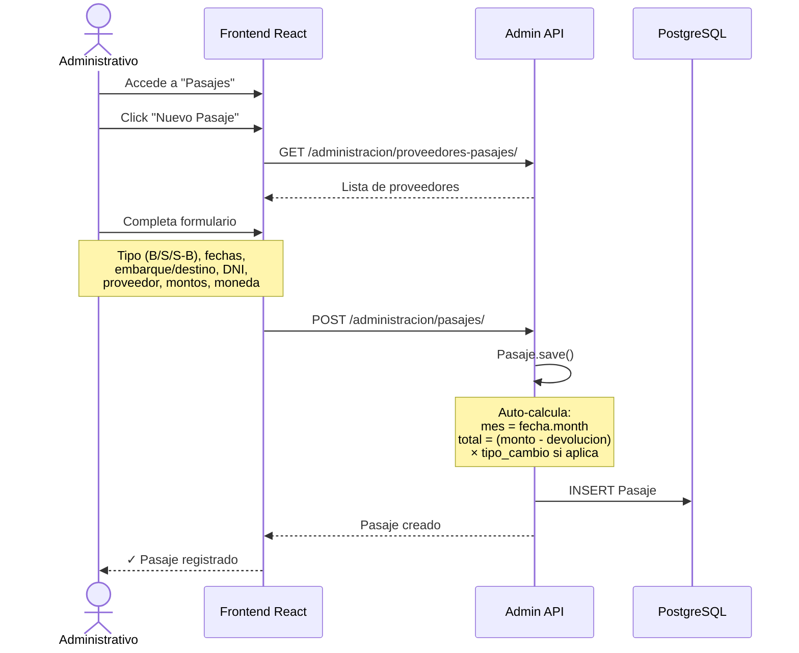
```mermaid
sequenceDiagram
    actor ADM as Administrativo
    participant UI as Frontend React
    participant API as Admin API
    participant DB as PostgreSQL

    ADM->>UI: Accede a "Pasajes"
    ADM->>UI: Click "Nuevo Pasaje"

    UI->>API: GET /administracion/proveedores-pasajes/
    API-->>UI: Lista de proveedores

    ADM->>UI: Completa formulario
    Note over ADM,UI: Tipo (B/S/S-B), fechas,<br/>embarque/destino, DNI,<br/>proveedor, montos, moneda

    UI->>API: POST /administracion/pasajes/
    API->>API: Pasaje.save()
    Note over API: Auto-calcula:<br/>mes = fecha.month<br/>total = (monto - devolucion)<br/>× tipo_cambio si aplica

    API->>DB: INSERT Pasaje
    API-->>UI: Pasaje creado
    UI-->>ADM: ✓ Pasaje registrado
```

---

## 5. Casos de Uso — Módulo de Soporte TI

### 5.1 Diagrama de Casos de Uso

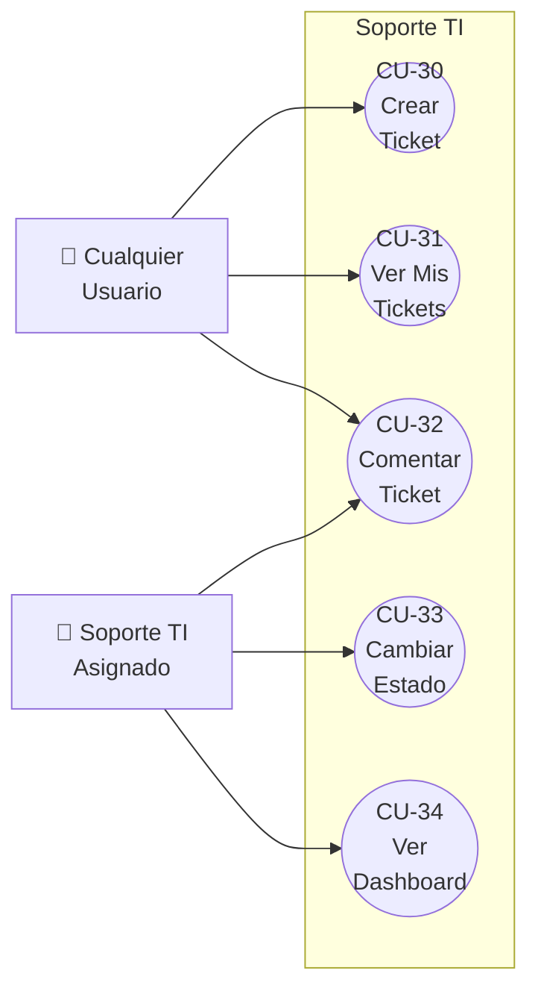
```mermaid
graph LR
    USR[👤 Cualquier<br/>Usuario]
    TI[👤 Soporte TI<br/>Asignado]

    subgraph "Soporte TI"
        CU30((CU-30<br/>Crear<br/>Ticket))
        CU31((CU-31<br/>Ver Mis<br/>Tickets))
        CU32((CU-32<br/>Comentar<br/>Ticket))
        CU33((CU-33<br/>Cambiar<br/>Estado))
        CU34((CU-34<br/>Ver<br/>Dashboard))
    end

    USR --> CU30
    USR --> CU31
    USR --> CU32
    TI --> CU32
    TI --> CU33
    TI --> CU34
```

### 5.2 Secuencia: Crear y Gestionar Ticket (CU-30)

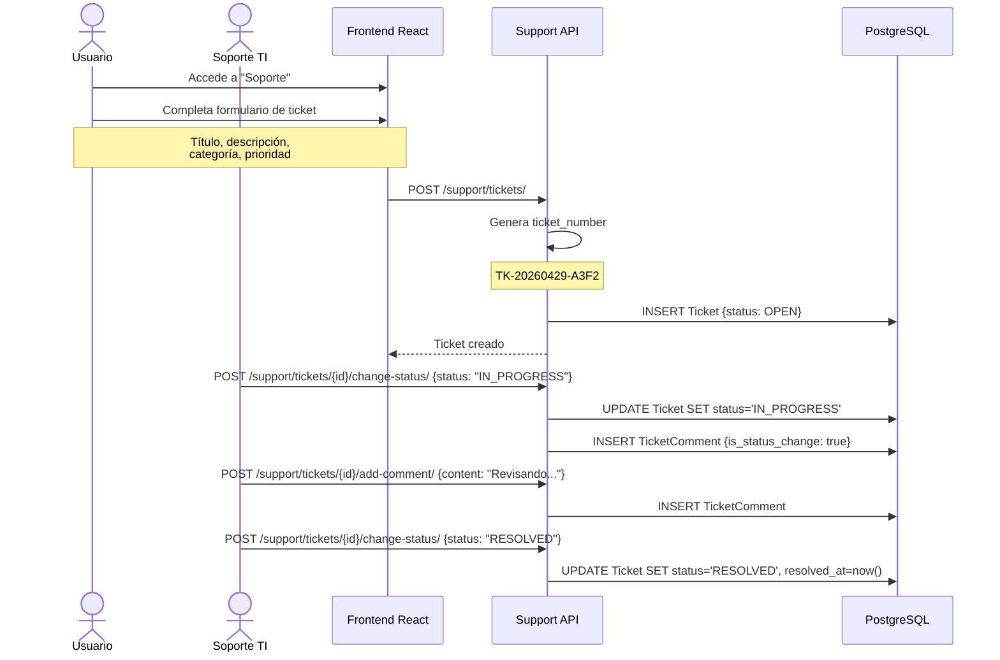
```mermaid
sequenceDiagram
    actor USR as Usuario
    actor TI as Soporte TI
    participant UI as Frontend React
    participant API as Support API
    participant DB as PostgreSQL

    USR->>UI: Accede a "Soporte"
    USR->>UI: Completa formulario de ticket
    Note over USR,UI: Título, descripción,<br/>categoría, prioridad

    UI->>API: POST /support/tickets/
    API->>API: Genera ticket_number
    Note over API: TK-20260429-A3F2
    API->>DB: INSERT Ticket {status: OPEN}
    API-->>UI: Ticket creado

    TI->>API: POST /support/tickets/{id}/change-status/ {status: "IN_PROGRESS"}
    API->>DB: UPDATE Ticket SET status='IN_PROGRESS'
    API->>DB: INSERT TicketComment {is_status_change: true}

    TI->>API: POST /support/tickets/{id}/add-comment/ {content: "Revisando..."}
    API->>DB: INSERT TicketComment

    TI->>API: POST /support/tickets/{id}/change-status/ {status: "RESOLVED"}
    API->>DB: UPDATE Ticket SET status='RESOLVED', resolved_at=now()
```

---

## 6. Casos de Uso — Autenticación y Sesión

### 6.1 Diagrama de Casos de Uso

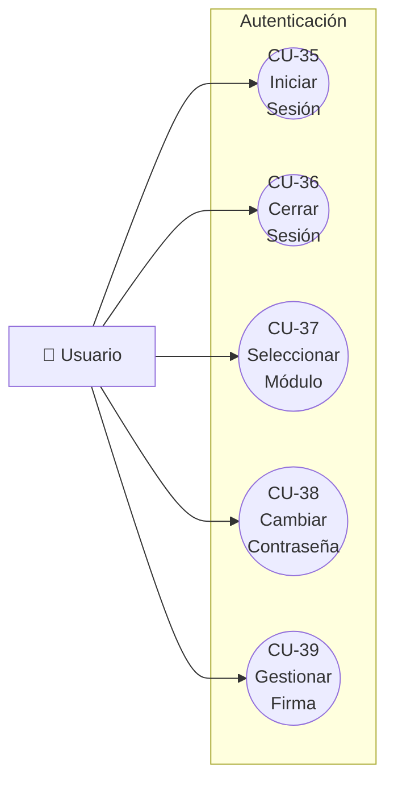
```mermaid
graph LR
    USR[👤 Usuario]

    subgraph "Autenticación"
        CU35((CU-35<br/>Iniciar<br/>Sesión))
        CU36((CU-36<br/>Cerrar<br/>Sesión))
        CU37((CU-37<br/>Seleccionar<br/>Módulo))
        CU38((CU-38<br/>Cambiar<br/>Contraseña))
        CU39((CU-39<br/>Gestionar<br/>Firma))
    end

    USR --> CU35
    USR --> CU36
    USR --> CU37
    USR --> CU38
    USR --> CU39
```

### 6.2 Secuencia: Iniciar Sesión (CU-35)

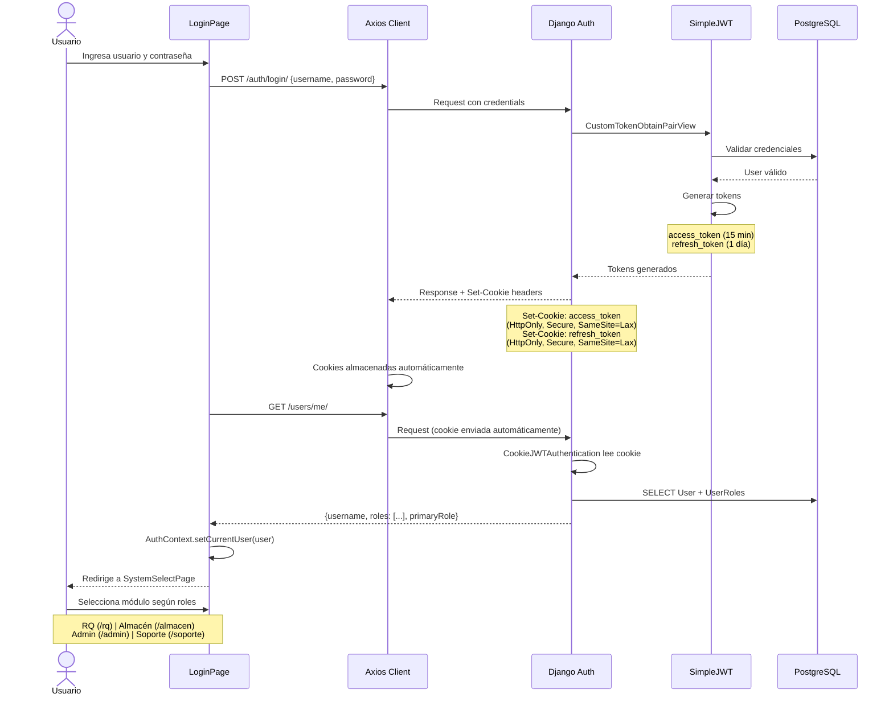
```mermaid
sequenceDiagram
    actor USR as Usuario
    participant UI as LoginPage
    participant AX as Axios Client
    participant API as Django Auth
    participant JWT as SimpleJWT
    participant DB as PostgreSQL

    USR->>UI: Ingresa usuario y contraseña
    UI->>AX: POST /auth/login/ {username, password}

    AX->>API: Request con credentials
    API->>JWT: CustomTokenObtainPairView
    JWT->>DB: Validar credenciales
    DB-->>JWT: User válido

    JWT->>JWT: Generar tokens
    Note over JWT: access_token (15 min)<br/>refresh_token (1 día)

    JWT-->>API: Tokens generados
    API-->>AX: Response + Set-Cookie headers
    Note over API: Set-Cookie: access_token<br/>(HttpOnly, Secure, SameSite=Lax)<br/>Set-Cookie: refresh_token<br/>(HttpOnly, Secure, SameSite=Lax)

    AX->>AX: Cookies almacenadas automáticamente

    UI->>AX: GET /users/me/
    AX->>API: Request (cookie enviada automáticamente)
    API->>API: CookieJWTAuthentication lee cookie
    API->>DB: SELECT User + UserRoles
    API-->>UI: {username, roles: [...], primaryRole}

    UI->>UI: AuthContext.setCurrentUser(user)
    UI-->>USR: Redirige a SystemSelectPage

    USR->>UI: Selecciona módulo según roles
    Note over USR,UI: RQ (/rq) | Almacén (/almacen)<br/>Admin (/admin) | Soporte (/soporte)
```

### 6.3 Secuencia: Refresh Token Automático

```mermaid
sequenceDiagram
    participant UI as Componente React
    participant AX as Axios Interceptor
    participant API as Django Auth
    participant JWT as SimpleJWT

    UI->>AX: GET /requests/ (cookie access_token expirado)
    AX->>API: Request
    API-->>AX: 401 Unauthorized

    AX->>AX: Interceptor detecta 401
    AX->>AX: isRefreshing = true
    AX->>AX: Encola requests pendientes

    AX->>API: POST /auth/token/refresh/
    Note over AX,API: Cookie refresh_token<br/>se envía automáticamente

    API->>JWT: Rotar tokens
    JWT->>JWT: Blacklist refresh token anterior
    JWT->>JWT: Generar nuevo par de tokens
    JWT-->>API: Nuevos tokens

    API-->>AX: Set-Cookie: new access_token + new refresh_token

    AX->>AX: isRefreshing = false
    AX->>AX: Reintentar requests encolados
    AX->>API: GET /requests/ (nuevo access_token)
    API-->>AX: 200 OK + datos
    AX-->>UI: Datos de requests
```

---

## 7. Matriz de Casos de Uso por Actor

| Caso de Uso | REQ | PR | PC | GM | LC | LS | LCH | CW | SW | DS | AM |
|-------------|:---:|:--:|:--:|:--:|:--:|:--:|:---:|:--:|:--:|:--:|:--:|
| CU-01 Crear RQ | ✓ | | | | | | | | | | |
| CU-02 Enviar RQ | ✓ | | | | | | | | | | |
| CU-03 Validación Técnica | | ✓ | | | | | | | | | |
| CU-04 Clasificación Presupuestal | | | ✓ | | | | | | | | |
| CU-05 Validación Administrativa | | | | | | | | | | ✓ | ✓ |
| CU-06 Aprobación GG | | | | ✓ | | | | | | | |
| CU-07 Verificar Stock | | | | | ✓ | ✓ | | | | | |
| CU-08 Gestionar Cotizaciones | | | | | ✓ | ✓ | ✓ | | | | |
| CU-09 Generar OC | | | | | ✓ | ✓ | | | | | |
| CU-10 Recepción y QC | | | | | ✓ | ✓ | | | | | |
| CU-11 Despacho y Entrega | | | | | | | | ✓ | ✓ | | |
| CU-12 Conformidad | ✓ | | | | | | | | | | |
| CU-13 Cierre de RQ | | | | | ✓ | ✓ | | | | | |
| CU-14 Cancelar RQ | ✓ | ✓ | ✓ | ✓ | ✓ | ✓ | | | | ✓ | ✓ |
| CU-15 Registrar Entrada | | | | | | | | ✓ | | | |
| CU-19 Registrar Salida | | | | | | | | ✓ | | | |
| CU-21 Consultar Kardex | | | | | ✓ | ✓ | ✓ | ✓ | ✓ | | |
| CU-22 Transferir Stock | | | | | | | | ✓ | ✓ | | |
| CU-24 Registrar Pasaje | | | | | | | | | | | ✓ |
| CU-30 Crear Ticket | ✓ | ✓ | ✓ | ✓ | ✓ | ✓ | ✓ | ✓ | ✓ | ✓ | ✓ |
| CU-35 Iniciar Sesión | ✓ | ✓ | ✓ | ✓ | ✓ | ✓ | ✓ | ✓ | ✓ | ✓ | ✓ |

---

*Documento generado para SYSPCC v1.0 — PCC Ingeniería y Construcción*
*Última actualización: Abril 2026*
