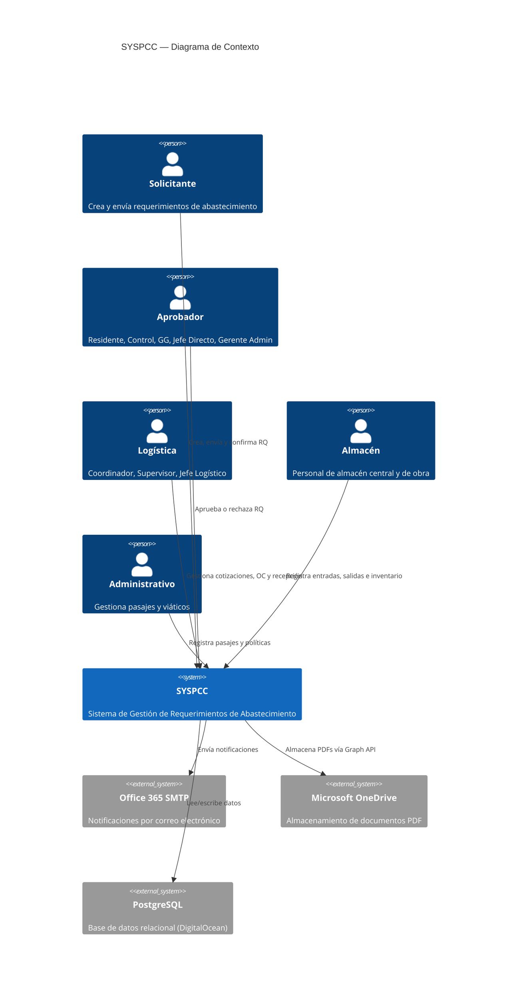
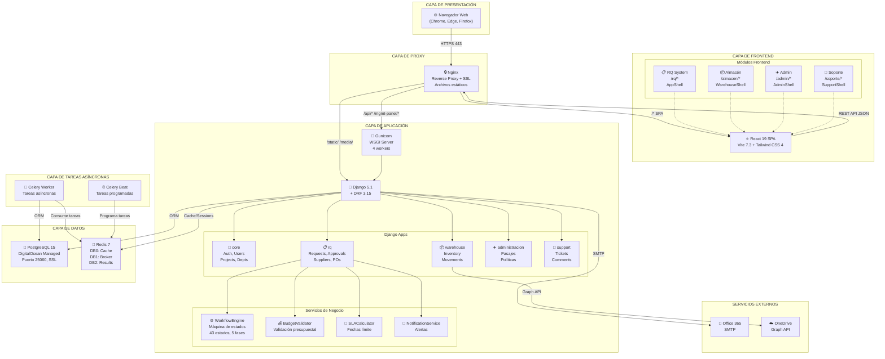
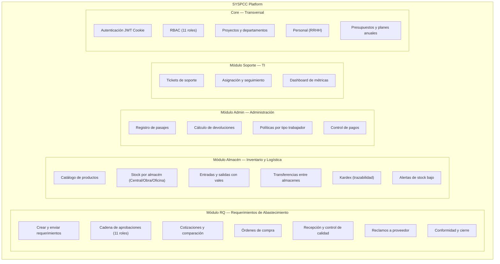
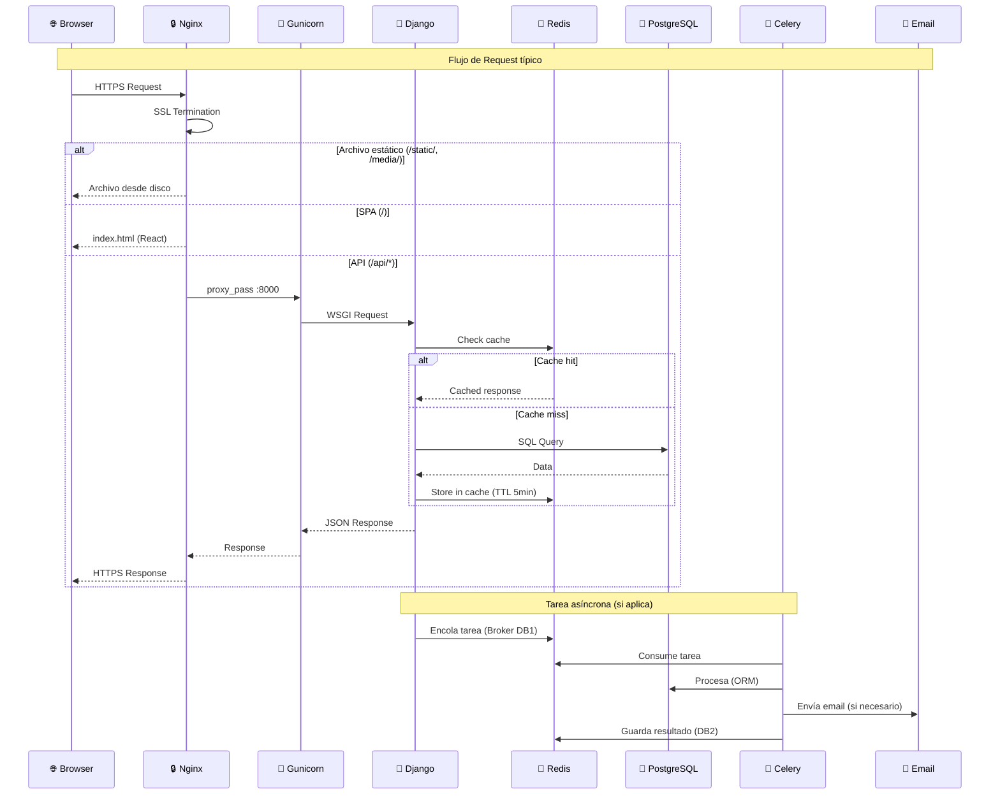
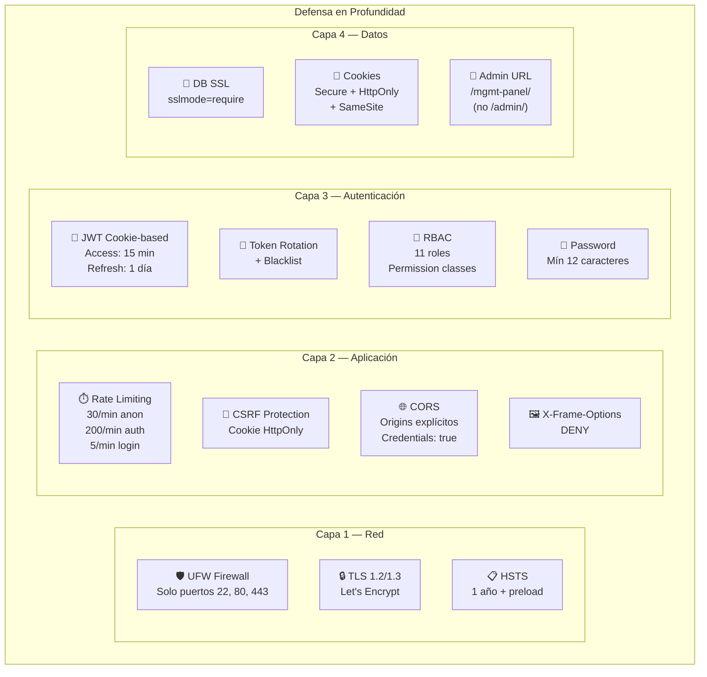
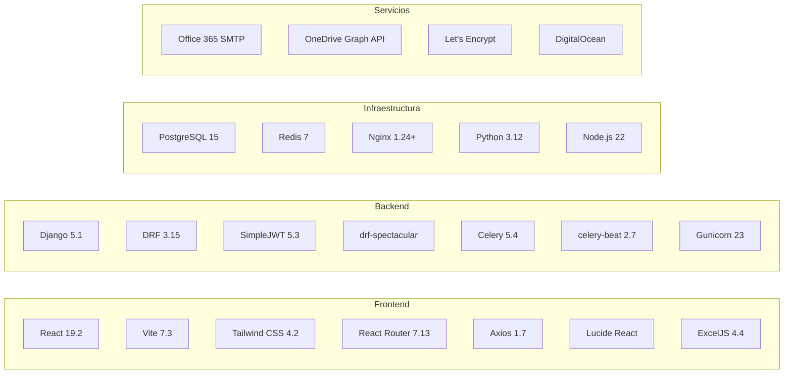

# SYSPCC — Arquitectura de Alto Nivel

**Sistema de Gestión de Requerimientos de Abastecimiento**
**Versión:** 1.0 | **Fecha:** Abril 2026 | **Empresa:** PCC Ingeniería y Construcción

---

## 1. Vista General del Sistema



---

## 2. Arquitectura de Capas



---

## 3. Módulos del Sistema



---

## 4. Flujo de Comunicación



---

## 5. Flujos de Negocio Principales

### 5.1 Ciclo de Vida del Requerimiento (RQ)

```mermaid
graph LR
    subgraph "FASE 1<br/>Solicitud"
        F1A[DRAFT] -->|submit| F1B[SUBMITTED]
    end

    subgraph "FASE 2<br/>Validación"
        F1B -->|approve| F2A[TECHNICAL_APPROVED<br/>o SUPERVISOR_APPROVED]
        F2A -->|classify| F2B{¿Presupuesto?}
        F2B -->|dentro| F2C[VALIDATED]
        F2B -->|adicional/fuera| F2D[GM_REVIEW]
        F2D -->|approve| F2C
    end

    subgraph "FASE 3<br/>Logística"
        F2C -->|check stock| F3A{¿Stock?}
        F3A -->|sí| F3B[IN_STOCK]
        F3A -->|no| F3C[REQUIRES_PURCHASE]
        F3C --> F3D[QUOTING]
        F3D --> F3E[QUOTE_SELECTED]
        F3E --> F3F[PO_GENERATED]
    end

    subgraph "FASE 4<br/>Recepción"
        F3F -->|receive| F4A[RECEIVING]
        F4A -->|QC ok| F4B[QUALITY_APPROVED]
        F4B --> F4C[DISPATCHED_TO_SITE]
        F3B --> F4C
        F4C --> F4D[DELIVERED]
    end

    subgraph "FASE 5<br/>Cierre"
        F4D -->|confirm| F5A[USER_CONFORMITY]
        F5A -->|close| F5B[CLOSED]
    end
```



### 5.2 Ciclo Operativo del Almacén

```mermaid
graph LR
    subgraph "FASE 01<br/>Recepción"
        A1["📦 Descarga de<br/>mercadería"]
        A2["📄 Validación<br/>documentaria"]
        A3["🔍 Verificación<br/>física"]
    end

    subgraph "FASE 02<br/>Control"
        B1["🔎 Inspección<br/>de calidad"]
        B2{Conformidad}
        B3["✅ Aprobado"]
        B4["❌ Rechazado"]
    end

    subgraph "FASE 03<br/>Almacenamiento"
        C1["📍 Asignación<br/>de ubicación"]
        C2["📊 Actualización<br/>de stock"]
    end

    subgraph "FASE 04<br/>Picking"
        D1["📋 Lista de<br/>picking"]
        D2["🏃 Recorrido<br/>por almacén"]
        D3["✔️ Verificación<br/>de cantidades"]
    end

    subgraph "FASE 05<br/>Packing"
        E1["📦 Selección<br/>de empaque"]
        E2["🏷️ Etiquetado"]
    end

    subgraph "FASE 06<br/>Despacho"
        F1["🚚 Carga de<br/>vehículo"]
        F2["📝 Registro<br/>de salida"]
    end

    A1 --> A2 --> A3 --> B1
    B1 --> B2
    B2 -->|conforme| B3
    B2 -->|no conforme| B4
    B3 --> C1 --> C2
    B4 -->|devolver| A1
    C2 --> D1 --> D2 --> D3
    D3 --> E1 --> E2
    E2 --> F1 --> F2
```



---

## 6. Infraestructura de Despliegue

```mermaid
graph TB
    subgraph "Internet"
        USERS["👥 Usuarios<br/>(Obra / Oficina)"]
    end

    subgraph "DNS"
        DNS["🌐 syspcc.pcc.com.pe"]
    end

    subgraph "VPS — DigitalOcean Droplet"
        subgraph "Capa Web"
            NGINX2["Nginx<br/>:443 HTTPS<br/>:80 → redirect<br/>SSL Let's Encrypt"]
        end

        subgraph "Capa Aplicación"
            GUN["Gunicorn<br/>:8000 (local)<br/>4 workers<br/>gthread"]
            DJANGO2["Django 5.1<br/>Production settings<br/>DEBUG=False"]
        end

        subgraph "Archivos"
            STATIC["📁 /staticfiles/<br/>ManifestStorage"]
            MEDIA["📁 /media/<br/>Uploads"]
            DIST["📁 /frontend/dist/<br/>React Build"]
        end

        subgraph "Servicios"
            REDIS2["Redis 7<br/>:6379 (local)<br/>bind 127.0.0.1"]
            CELW["Celery Worker<br/>concurrency=2"]
            CELB["Celery Beat<br/>DatabaseScheduler"]
        end
    end

    subgraph "DigitalOcean Managed Database"
        PG2["PostgreSQL 15<br/>:25060<br/>SSL required<br/>Backups automáticos"]
    end

    subgraph "Servicios Externos"
        SMTP["📧 Office 365<br/>smtp.office365.com:587"]
        OD["☁️ OneDrive<br/>Graph API"]
    end

    USERS -->|HTTPS| DNS
    DNS --> NGINX2
    NGINX2 -->|/api/*| GUN --> DJANGO2
    NGINX2 -->|/*| DIST
    NGINX2 --> STATIC
    NGINX2 --> MEDIA
    DJANGO2 --> REDIS2
    DJANGO2 -->|SSL :25060| PG2
    CELW --> REDIS2
    CELB --> REDIS2
    CELW --> PG2
    DJANGO2 --> SMTP
    DJANGO2 --> OD
```

---

## 7. Seguridad — Vista de Alto Nivel



---

## 8. Tecnologías y Versiones



---

## 9. Resumen de Endpoints API

```mermaid
graph TB
    subgraph "/api/v1/"
        subgraph "Auth"
            A_LOGIN[POST /auth/login/]
            A_REFRESH[POST /auth/token/refresh/]
            A_LOGOUT[POST /auth/logout/]
        end

        subgraph "Core"
            C_USERS[GET/POST /users/]
            C_PROJ[GET /projects/]
            C_DEPT[GET /departments/]
            C_PERS[GET/POST /personal/]
            C_BUDG[GET /project-budget-lines/]
            C_PLAN[GET /annual-plans/]
        end

        subgraph "RQ"
            R_REQ[GET/POST /requests/]
            R_ACT[POST /requests/{id}/action/]
            R_AVAIL[GET /requests/{id}/available-actions/]
            R_APPR[GET /requests/{id}/approvals/]
            R_SUP[GET/POST /suppliers/]
            R_QUO[GET/POST /quotations/]
            R_PO[GET/POST /purchase-orders/]
            R_CLA[GET/POST /claims/]
            R_NOT[GET /notifications/]
        end

        subgraph "Warehouse"
            W_INV[GET/POST /warehouse/inventory/]
            W_KAR[GET /warehouse/inventory/{id}/kardex/]
            W_MOV[GET/POST /warehouse/movements/]
            W_BATCH[POST /warehouse/movements/entry-batch/]
            W_VOUCH[GET /warehouse/movements/{id}/voucher/]
        end

        subgraph "Admin"
            AD_PAS[GET/POST /administracion/pasajes/]
            AD_PRO[GET/POST /administracion/proveedores-pasajes/]
            AD_POL[GET/POST /administracion/politicas-devolucion/]
        end

        subgraph "Support"
            S_TIK[GET/POST /support/tickets/]
            S_COM[POST /support/tickets/{id}/add-comment/]
            S_STA[POST /support/tickets/{id}/change-status/]
        end
    end
```

---

*Documento generado para SYSPCC v1.0 — PCC Ingeniería y Construcción*
*Última actualización: Abril 2026*
