# SYSPCC — Arquitectura de Bajo Nivel

**Sistema de Gestión de Requerimientos de Abastecimiento**
**Versión:** 1.0 | **Fecha:** Abril 2026 | **Empresa:** PCC Ingeniería y Construcción

---

## 1. Estructura de Capas del Backend

### 1.1 Flujo completo de un Request HTTP

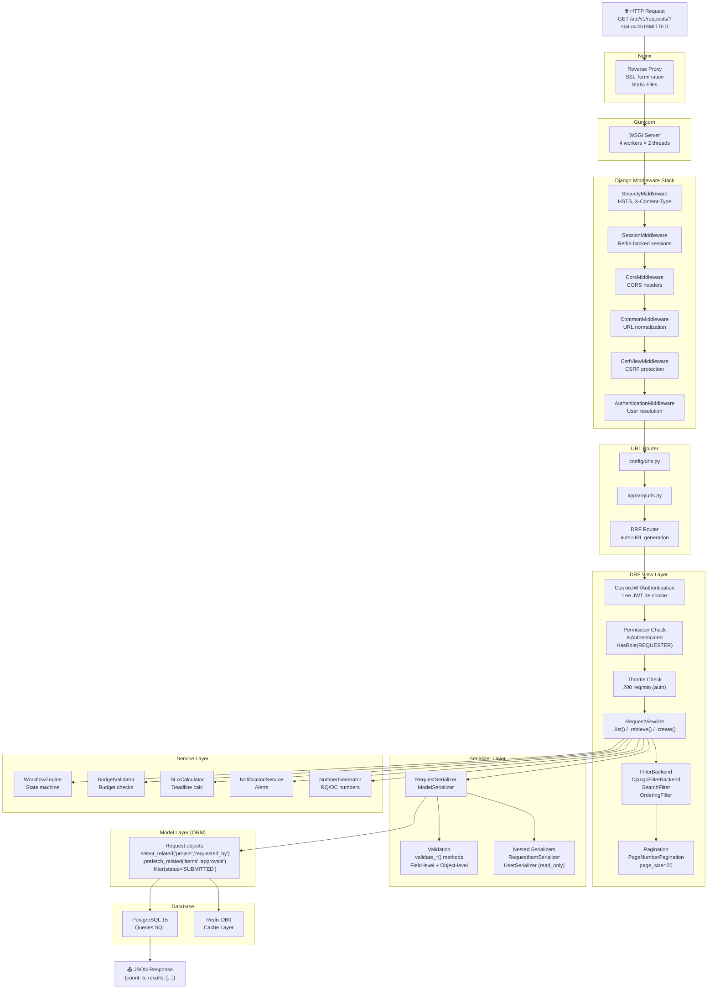

### 1.2 Responsabilidad de cada capa

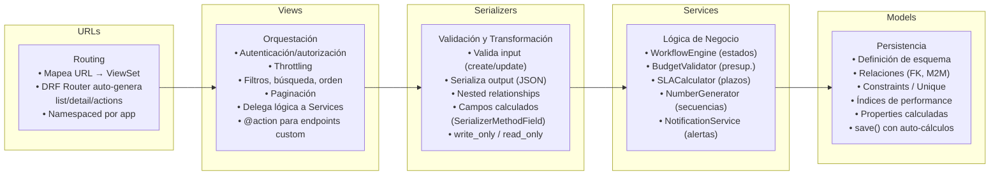

---

## 2. Estructura de Archivos del Backend

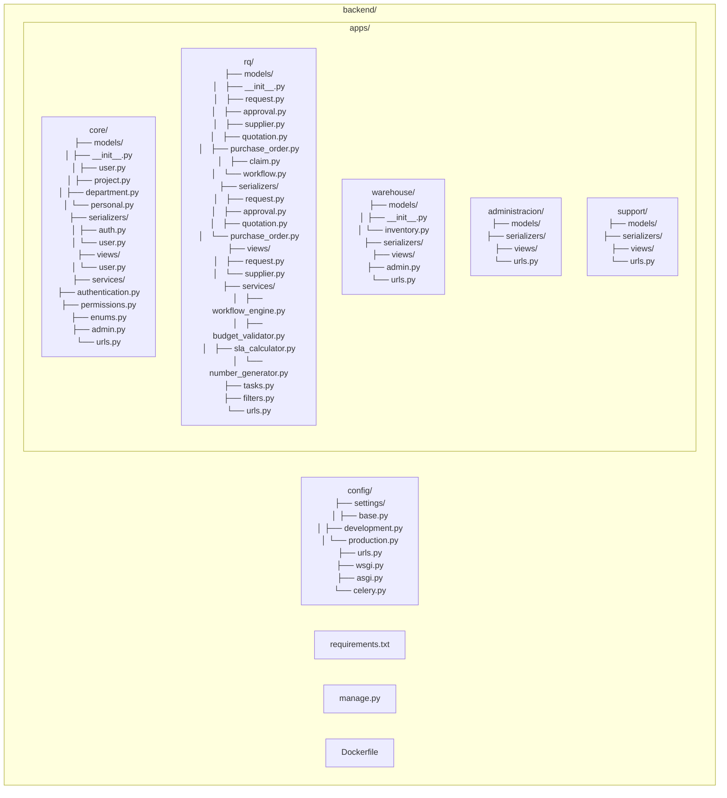

---

## 3. Estructura de Componentes del Frontend

### 3.1 Árbol de Componentes React

```mermaid
graph TB
    subgraph "App.jsx — Raíz"
        AP["AuthProvider<br/>(AuthContext)"]
        TP["ToastProvider<br/>(ToastContext)"]
        BR["BrowserRouter<br/>(React Router v7)"]
    end

    subgraph "Rutas Públicas"
        LOGIN["LoginPage<br/>/login"]
        SYSSEL["SystemSelectPage<br/>/"]
    end

    subgraph "Shell RQ — /rq/*"
        APPSH["AppShell"]
        HEADER["Header"]
        SIDEBAR["Sidebar"]

        subgraph "Páginas RQ"
            DASH["DashboardPage"]
            RLIST["RequestListPage"]
            RCREATE["RequestCreatePage<br/>(46KB — formulario complejo)"]
            RDETAIL["RequestDetailPage<br/>(45KB — detalle + approvals)"]
        end

        subgraph "Páginas Aprobaciones"
            APPROV["ApprovalsPage"]
            TECH["TechReviewPage<br/>(PROJECT_RESIDENT)"]
            BUDG["BudgetReviewPage<br/>(PROJECT_CONTROL)"]
            QCR["QuoteCostReviewPage<br/>(PROJECT_CONTROL)"]
            MGR["ManagerApprovalPage<br/>(GENERAL_MANAGER)"]
            COST["CostOverrunReviewPage<br/>(GENERAL_MANAGER)"]
        end

        subgraph "Páginas Operaciones"
            LOGP["LogisticsPage"]
            LOGA["LogisticsActionPage<br/>(113KB — más grande)"]
        end

        REPOR["ReportsPage<br/>(36KB — gráficos)"]
    end

    subgraph "Shell Almacén — /almacen/*"
        WHSH["WarehouseShell"]
        WHSB["WarehouseSidebar"]

        WHDASH["AlmacenDashboardPage"]
        INV["InventarioPage<br/>(27KB)"]
        KAR["KardexPage"]
        ENT["EntradaPage<br/>(21KB)"]
        SAL["SalidaPage<br/>(23KB)"]
        VOUCH["VoucherPrint"]
        MOV["MovimientosPage"]
    end

    subgraph "Shell Admin — /admin/*"
        ADMSH["AdminShell"]
        ADMSB["AdminSidebar"]

        ADMDASH["AdminDashboardPage"]
        PAS["PasajesPage<br/>(46KB)"]
        PAG["PagosPage"]
        POL["PoliticasPage"]
        PROV["ProveedoresPage"]
    end

    subgraph "Shell Soporte — /soporte/*"
        SUPSH["SupportShell"]
        SUPSB["SupportSidebar"]

        SUPDASH["SupportDashboardPage"]
        TIKC["TicketCreatePage"]
        TIKL["TicketListPage"]
        TIKD["TicketDetailPage"]
    end

    SETT["SettingsPage<br/>/settings"]

    AP --> TP --> BR
    BR --> LOGIN
    BR --> SYSSEL
    BR --> APPSH
    BR --> WHSH
    BR --> ADMSH
    BR --> SUPSH
    BR --> SETT

    APPSH --> HEADER
    APPSH --> SIDEBAR
    APPSH --> DASH
    APPSH --> RLIST
    APPSH --> RCREATE
    APPSH --> RDETAIL
    APPSH --> APPROV
    APPSH --> TECH
    APPSH --> BUDG
    APPSH --> QCR
    APPSH --> MGR
    APPSH --> COST
    APPSH --> LOGP
    APPSH --> LOGA
    APPSH --> REPOR

    WHSH --> HEADER
    WHSH --> WHSB
    WHSH --> WHDASH
    WHSH --> INV
    WHSH --> KAR
    WHSH --> ENT
    WHSH --> SAL
    WHSH --> VOUCH
    WHSH --> MOV

    ADMSH --> HEADER
    ADMSH --> ADMSB
    ADMSH --> ADMDASH
    ADMSH --> PAS
    ADMSH --> PAG
    ADMSH --> POL
    ADMSH --> PROV

    SUPSH --> HEADER
    SUPSH --> SUPSB
    SUPSH --> SUPDASH
    SUPSH --> TIKC
    SUPSH --> TIKL
    SUPSH --> TIKD
```

### 3.2 Componentes Reutilizables

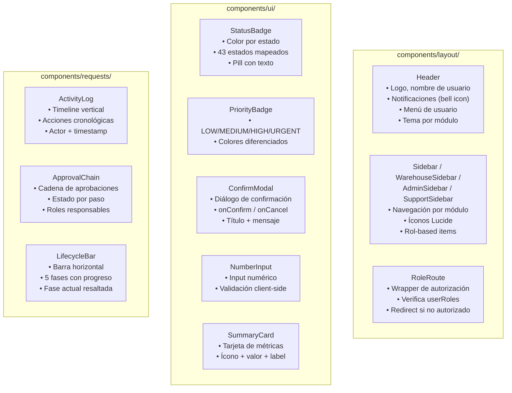

### 3.3 Estructura de Archivos del Frontend

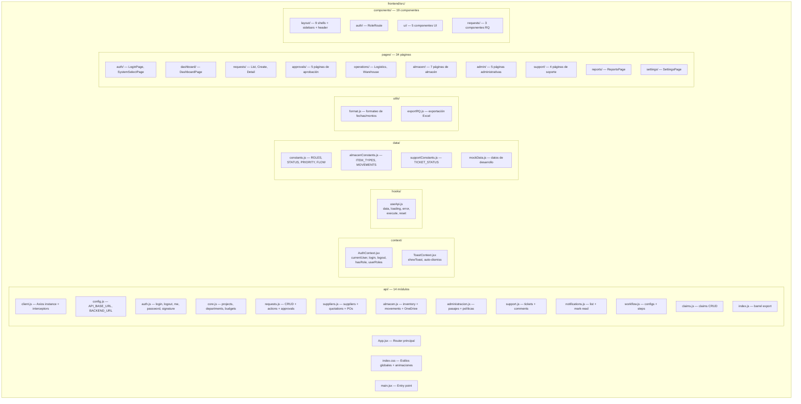

---

## 4. Capa de Comunicación API

### 4.1 Flujo Request/Response completo

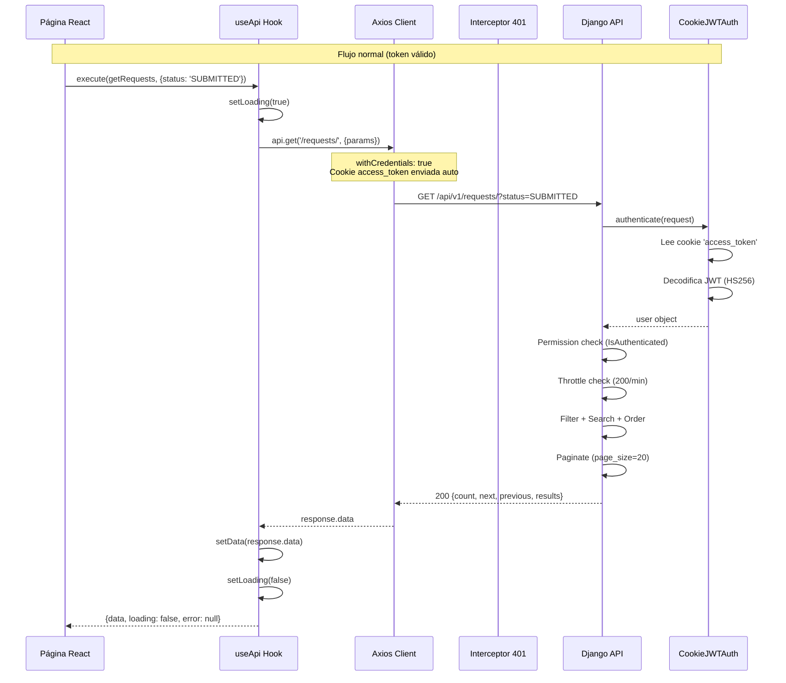

### 4.2 Flujo de Refresh Token (401)

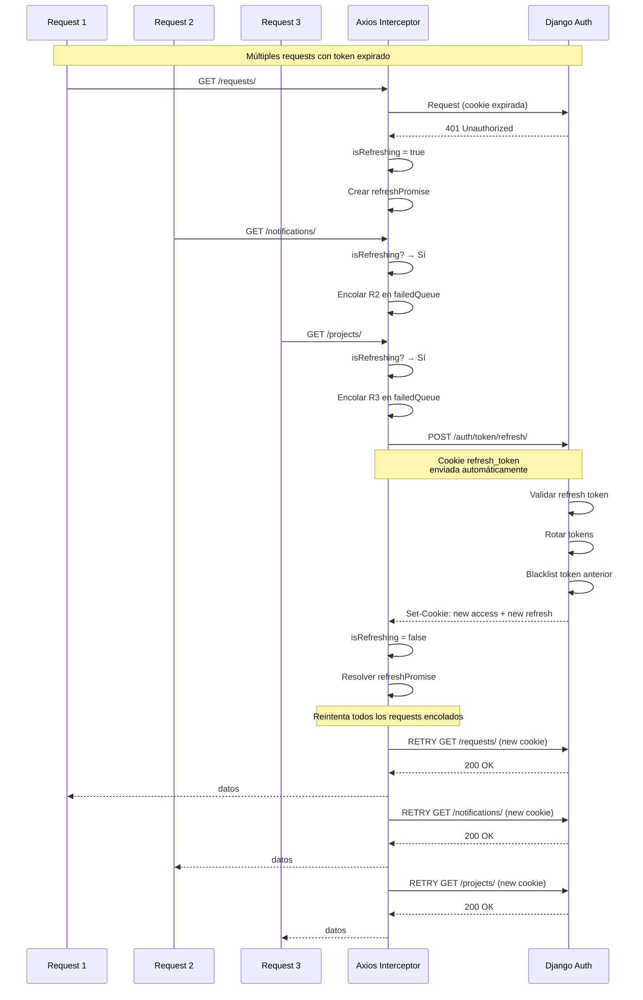

### 4.3 Estructura del Axios Client

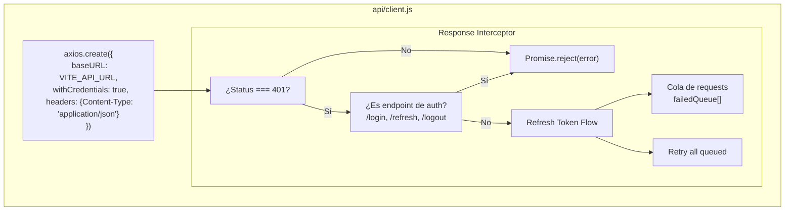

---

## 5. Motor de Workflow — Máquina de Estados Detallada

### 5.1 Flujo OPERATIONS — Diagrama Completo

```mermaid
stateDiagram-v2
    [*] --> DRAFT

    state "FASE 1 — Solicitud" as F1 {
        DRAFT --> SUBMITTED: submit<br/>[REQUESTER]
    }

    state "FASE 2 — Validación Técnica y Presupuestal" as F2 {
        SUBMITTED --> TECHNICAL_APPROVED: approve<br/>[PROJECT_RESIDENT]
        SUBMITTED --> TECHNICAL_REJECTED: reject<br/>[PROJECT_RESIDENT]

        TECHNICAL_APPROVED --> WITHIN_PROPOSAL: classify_within<br/>[PROJECT_CONTROL]
        TECHNICAL_APPROVED --> ADDITIONAL_REQ: classify_additional<br/>[PROJECT_CONTROL]
        TECHNICAL_APPROVED --> TECHNICAL_REJECTED: reject<br/>[PROJECT_CONTROL]

        WITHIN_PROPOSAL --> VALIDATED: auto_transition

        ADDITIONAL_REQ --> GM_REVIEW: approve<br/>[PROJECT_RESIDENT]
        ADDITIONAL_REQ --> TECHNICAL_REJECTED: reject<br/>[PROJECT_RESIDENT]

        GM_REVIEW --> GM_APPROVED: approve<br/>[GENERAL_MANAGER]
        GM_REVIEW --> GM_REJECTED: reject<br/>[GENERAL_MANAGER]

        GM_APPROVED --> VALIDATED: auto_transition
    }

    state "FASE 3 — Logística y Compras" as F3 {
        VALIDATED --> IN_STOCK: mark_in_stock<br/>[LOGISTICS_COORDINATOR]
        VALIDATED --> REQUIRES_PURCHASE: mark_requires_purchase<br/>[LOGISTICS_COORDINATOR]

        REQUIRES_PURCHASE --> QUOTING: start_quoting<br/>[LOGISTICS_COORDINATOR]
        QUOTING --> QUOTE_COMPARISON: compare_quotes<br/>[LOGISTICS_COORDINATOR]
        QUOTE_COMPARISON --> QUOTE_SELECTED: select_quote<br/>[LOGISTICS_COORDINATOR]

        QUOTE_SELECTED --> QUOTE_COST_APPROVED: approve_cost<br/>[PROJECT_CONTROL]
        QUOTE_SELECTED --> COST_OVERRUN_REVIEW: reject_cost<br/>[PROJECT_CONTROL]

        COST_OVERRUN_REVIEW --> COST_OVERRUN_APPROVED: approve<br/>[GENERAL_MANAGER]
        COST_OVERRUN_REVIEW --> COST_OVERRUN_REJECTED: reject<br/>[GENERAL_MANAGER]

        QUOTE_COST_APPROVED --> PO_GENERATED: generate_po<br/>[LOGISTICS_COORDINATOR]
        COST_OVERRUN_APPROVED --> PO_GENERATED: generate_po<br/>[LOGISTICS_COORDINATOR]
    }

    state "FASE 4 — Recepción y Entrega" as F4 {
        PO_GENERATED --> RECEIVING: receive<br/>[LOGISTICS_COORDINATOR]

        IN_STOCK --> DISPATCHED_TO_SITE: dispatch<br/>[CENTRAL_WAREHOUSE]

        RECEIVING --> QUALITY_APPROVED: approve_quality<br/>[LOGISTICS_COORDINATOR]
        RECEIVING --> QUALITY_REJECTED: reject_quality<br/>[LOGISTICS_COORDINATOR]

        QUALITY_APPROVED --> DISPATCHED_TO_SITE: dispatch<br/>[LOGISTICS_COORDINATOR]
        DISPATCHED_TO_SITE --> DELIVERED: confirm_delivery<br/>[SITE_WAREHOUSE]

        state "Ciclo de Reclamo" as CLAIM_CYCLE {
            QUALITY_REJECTED --> SUPPLIER_CLAIM_SENT: send_claim<br/>[LOGISTICS_COORDINATOR]
            SUPPLIER_CLAIM_SENT --> SUPPLIER_CLAIM_PENDING: pending<br/>[LOGISTICS_COORDINATOR]
            SUPPLIER_CLAIM_PENDING --> SUPPLIER_REPLACEMENT_RECEIVED: replacement<br/>[LOGISTICS_COORDINATOR]
            SUPPLIER_CLAIM_SENT --> SUPPLIER_REPLACEMENT_RECEIVED: direct_replacement
            SUPPLIER_REPLACEMENT_RECEIVED --> QUALITY_APPROVED: approve_quality
            SUPPLIER_REPLACEMENT_RECEIVED --> QUALITY_REJECTED: reject_quality
        }
    }

    state "FASE 5 — Conformidad y Cierre" as F5 {
        DELIVERED --> USER_CONFORMITY: confirm<br/>[REQUESTER]
        DELIVERED --> CLAIM_IN_REVIEW: claim<br/>[REQUESTER]

        CLAIM_IN_REVIEW --> SUPPLIER_CLAIM_SENT: send_claim<br/>[LOGISTICS_COORDINATOR]

        USER_CONFORMITY --> CLOSED: close<br/>[LOGISTICS_COORDINATOR]
    }

    state "Cancelación Universal" as CANCEL {
        note right of CANCELLED: Cualquier estado no-terminal<br/>puede ser cancelado por<br/>roles autorizados
    }

    TECHNICAL_REJECTED --> [*]
    GM_REJECTED --> [*]
    COST_OVERRUN_REJECTED --> [*]
    CLOSED --> [*]
    CANCELLED --> [*]
```

### 5.2 Flujo ADMINISTRATIVE — Diferencias con OPERATIONS

```mermaid
stateDiagram-v2
    [*] --> DRAFT

    state "FASE 1 — Solicitud" as F1A {
        DRAFT --> SUBMITTED: submit<br/>[REQUESTER]
    }

    state "FASE 2 — Validación Administrativa" as F2A {
        SUBMITTED --> SUPERVISOR_APPROVED: approve<br/>[DIRECT_SUPERVISOR]
        SUBMITTED --> SUPERVISOR_REJECTED: reject<br/>[DIRECT_SUPERVISOR]

        SUPERVISOR_APPROVED --> WITHIN_ANNUAL_PLAN: classify_within_plan<br/>[ADMIN_MANAGER]
        SUPERVISOR_APPROVED --> OUT_OF_ANNUAL_PLAN: classify_out_of_plan<br/>[ADMIN_MANAGER]
        SUPERVISOR_APPROVED --> SUPERVISOR_REJECTED: reject<br/>[ADMIN_MANAGER]

        WITHIN_ANNUAL_PLAN --> VALIDATED: auto_transition

        OUT_OF_ANNUAL_PLAN --> GM_REVIEW: approve<br/>[DIRECT_SUPERVISOR]
        OUT_OF_ANNUAL_PLAN --> SUPERVISOR_REJECTED: reject<br/>[DIRECT_SUPERVISOR]

        GM_REVIEW --> GM_APPROVED: approve<br/>[GENERAL_MANAGER]
        GM_REVIEW --> GM_REJECTED: reject<br/>[GENERAL_MANAGER]

        GM_APPROVED --> VALIDATED: auto_transition
    }

    state "FASE 3 — Logística" as F3A {
        note right of F3A: Roles diferentes:<br/>LOGISTICS_SUPERVISOR<br/>LOGISTICS_CHIEF<br/>Costo aprobado por ADMIN_MANAGER
        VALIDATED --> IN_STOCK: [LOGISTICS_SUPERVISOR]
        VALIDATED --> REQUIRES_PURCHASE: [LOGISTICS_SUPERVISOR]
    }

    state "FASE 4 — Recepción" as F4A {
        note right of F4A: Diferencia clave:<br/>IN_STOCK → DELIVERED (directo)<br/>DISPATCHED_TO_SITE → DELIVERED<br/>DELIVERED → WAREHOUSE_UPDATED
        IN_STOCK_ADM --> DELIVERED_ADM: dispatch directo
        DELIVERED_ADM --> WAREHOUSE_UPDATED: update_records<br/>[CENTRAL_WAREHOUSE]
    }

    state "FASE 5 — Conformidad" as F5A {
        note right of F5A: Conformidad parte de<br/>WAREHOUSE_UPDATED<br/>(no de DELIVERED)
        WAREHOUSE_UPDATED --> USER_CONFORMITY_ADM: confirm<br/>[REQUESTER]
        USER_CONFORMITY_ADM --> CLOSED_ADM: close<br/>[LOGISTICS_SUPERVISOR]
    }
```

### 5.3 Componentes Internos del WorkflowEngine

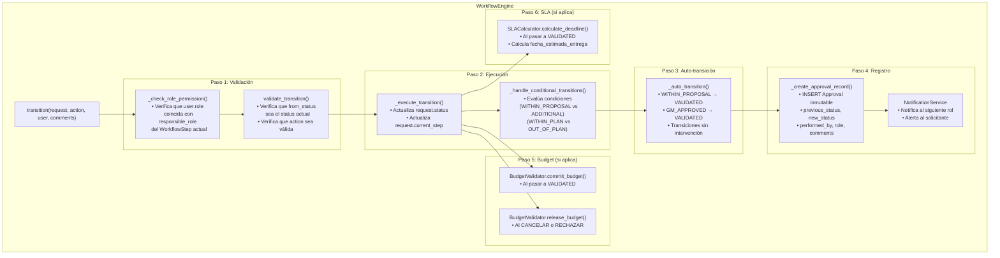

---

## 6. Arquitectura de Autenticación y Autorización

### 6.1 Flujo de Autenticación JWT Cookie-Based

```mermaid
sequenceDiagram
    participant B as Browser
    participant R as React App
    participant AX as Axios
    participant N as Nginx
    participant DJ as Django
    participant JWT as SimpleJWT
    participant DB as PostgreSQL
    participant RD as Redis

    Note over B,RD: === PASO 1: LOGIN ===
    B->>R: Ingresa usuario + contraseña
    R->>AX: authApi.login({username, password})
    AX->>N: POST /api/v1/auth/login/
    N->>DJ: proxy_pass
    DJ->>DJ: ThrottleCheck (5/min login)
    DJ->>JWT: CustomTokenObtainPairView
    JWT->>DB: SELECT * FROM core_user WHERE username=?
    DB-->>JWT: User record
    JWT->>JWT: Verificar contraseña (bcrypt)
    JWT->>JWT: Generar access_token (HS256, 15min)
    JWT->>JWT: Generar refresh_token (HS256, 1d)
    JWT-->>DJ: TokenPair

    DJ-->>N: 200 OK + Set-Cookie headers
    Note over DJ,N: Set-Cookie: access_token=eyJ...<br/>  HttpOnly; Secure; SameSite=Lax; Path=/; Max-Age=900<br/>Set-Cookie: refresh_token=eyJ...<br/>  HttpOnly; Secure; SameSite=Lax; Path=/auth/; Max-Age=86400
    N-->>AX: Response + Cookies
    AX-->>R: Login exitoso

    Note over B,RD: === PASO 2: CARGAR USUARIO ===
    R->>AX: authApi.getMe()
    AX->>N: GET /api/v1/users/me/
    Note over AX: Cookie access_token<br/>enviada automáticamente
    N->>DJ: Request
    DJ->>DJ: CookieJWTAuthentication
    DJ->>DJ: Lee cookie 'access_token'
    DJ->>JWT: Decodificar token
    JWT-->>DJ: payload {user_id, exp, ...}
    DJ->>DB: SELECT user + roles
    DB-->>DJ: User + UserRoles
    DJ-->>AX: {id, username, email, roles: [...]}
    AX-->>R: User data

    R->>R: AuthContext.setCurrentUser(user)
    R->>R: Redirect → SystemSelectPage

    Note over B,RD: === PASO 3: REQUESTS AUTENTICADOS ===
    R->>AX: requestsApi.getRequests()
    AX->>N: GET /api/v1/requests/
    Note over AX: Cookie enviada automáticamente
    N->>DJ: Request
    DJ->>DJ: CookieJWTAuthentication
    DJ->>DJ: IsAuthenticated ✓
    DJ->>RD: Check cache
    DJ->>DB: Query (si no cached)
    DJ-->>AX: 200 JSON data
    AX-->>R: Datos

    Note over B,RD: === PASO 4: TOKEN EXPIRA ===
    R->>AX: Cualquier API call
    AX->>N: GET /api/v1/...
    DJ-->>AX: 401 Unauthorized
    AX->>AX: Interceptor detecta 401
    AX->>N: POST /api/v1/auth/token/refresh/
    Note over AX: Cookie refresh_token<br/>enviada automáticamente
    DJ->>JWT: Validar refresh_token
    JWT->>JWT: Rotar: nuevo access + nuevo refresh
    JWT->>DB: Blacklist refresh anterior
    DJ-->>AX: Set-Cookie: nuevos tokens
    AX->>N: RETRY request original
    DJ-->>AX: 200 OK

    Note over B,RD: === PASO 5: LOGOUT ===
    R->>AX: authApi.logout()
    AX->>N: POST /api/v1/auth/logout/
    DJ->>DB: Blacklist refresh_token
    DJ-->>AX: Set-Cookie: clear tokens (Max-Age=0)
    AX-->>R: Logout OK
    R->>R: AuthContext.setCurrentUser(null)
    R->>R: Redirect → LoginPage
```

### 6.2 RBAC — Control de Acceso Basado en Roles

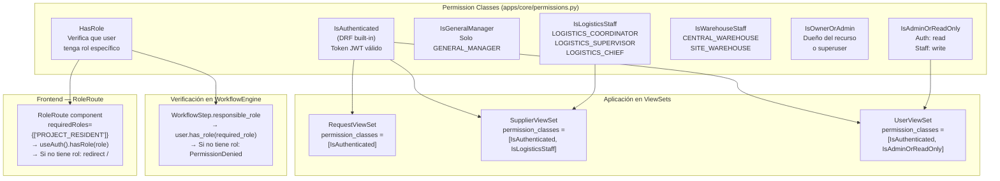

### 6.3 Matriz de Roles y Permisos por Endpoint

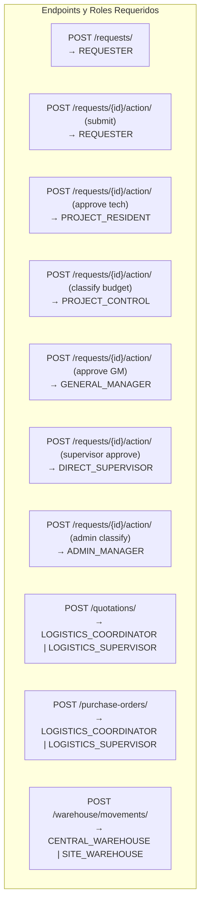

---

## 7. Arquitectura de Tareas Asíncronas (Celery)

### 7.1 Flujo de Tareas

```mermaid
graph TB
    subgraph "Django Application"
        T1["Tarea disparada<br/>por código Django"]
        T2["Tarea programada<br/>por Celery Beat"]
    end

    subgraph "Redis (DB1 — Broker)"
        Q["Cola de tareas<br/>Formato JSON<br/>FIFO"]
    end

    subgraph "Celery Worker"
        W["Worker Process<br/>concurrency=2<br/>prefork pool"]

        subgraph "Tareas Registradas"
            T_SLA["check_sla_deadlines()<br/>• Query RQ con fecha_estimada < hoy<br/>• Envía notificación a requester<br/>• Alerta a logistics"]
            T_REM["send_pending_approval_reminders()<br/>• Query Approvals pendientes >24h<br/>• Envía recordatorio al aprobador<br/>• Email si configurado"]
            T_CACHE["invalidate_dashboard_caches()<br/>• cache.delete_pattern('dashboard_*')<br/>• Fuerza recálculo en próximo request"]
            T_STOCK["warehouse_low_stock_check()<br/>• Query InventoryStock < min_stock<br/>• Envía alerta a CENTRAL_WAREHOUSE<br/>• Email a warehouse_alert_recipients"]
        end
    end

    subgraph "Redis (DB2 — Results)"
        RES["Resultados de tareas<br/>task_id → result<br/>TTL configurable"]
    end

    subgraph "Celery Beat"
        SCHED["DatabaseScheduler<br/>(django_celery_beat)"]

        subgraph "Schedule"
            S1["check-sla-deadlines<br/>crontab(hour=8, minute=0)<br/>8:00 AM Lima diario"]
            S2["send-pending-approval-reminders<br/>crontab(hour='9,14', minute=0)<br/>9:00 AM y 2:00 PM"]
            S3["invalidate-dashboard-caches<br/>crontab(minute='*/15')<br/>Cada 15 minutos"]
            S4["warehouse-low-stock-check<br/>crontab(hour=7, minute=30)<br/>7:30 AM Lima diario"]
        end
    end

    subgraph "External"
        DB["PostgreSQL<br/>(ORM queries)"]
        EMAIL["Office 365<br/>(SMTP notifications)"]
    end

    T1 -->|.delay()| Q
    T2 --> SCHED
    SCHED --> S1 & S2 & S3 & S4
    S1 & S2 & S3 & S4 -->|schedule| Q
    Q --> W
    W --> T_SLA & T_REM & T_CACHE & T_STOCK
    T_SLA --> DB
    T_SLA --> EMAIL
    T_REM --> DB
    T_REM --> EMAIL
    T_CACHE --> RES
    T_STOCK --> DB
    T_STOCK --> EMAIL
    W --> RES
```

### 7.2 Configuración de Celery

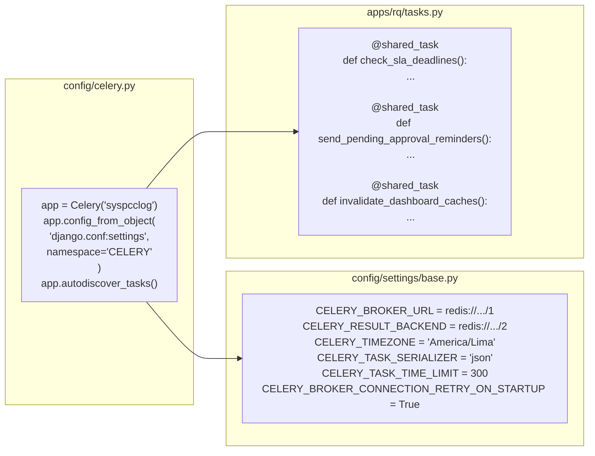

---

## 8. Arquitectura de Cache y Sesiones

### 8.1 Distribución de Redis

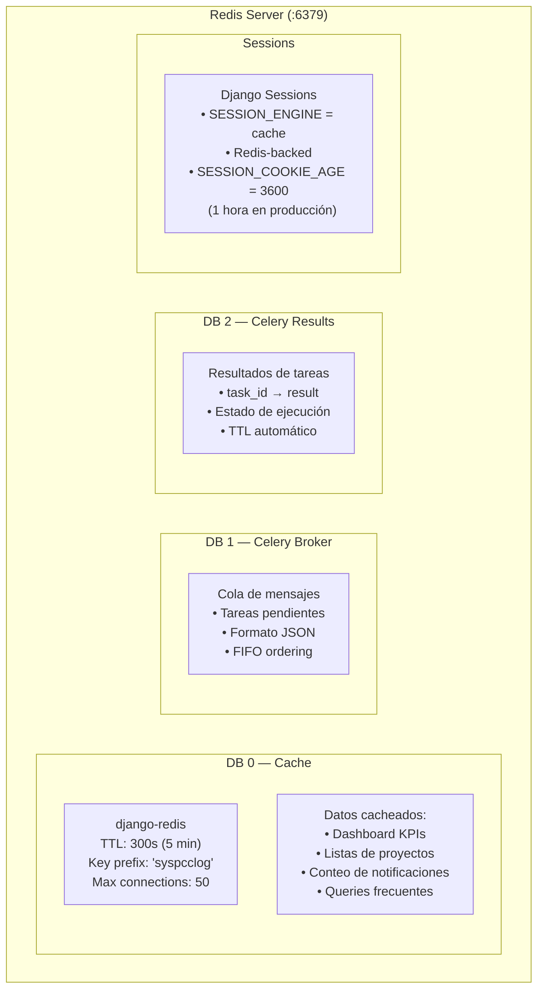

### 8.2 Estrategia de Cache

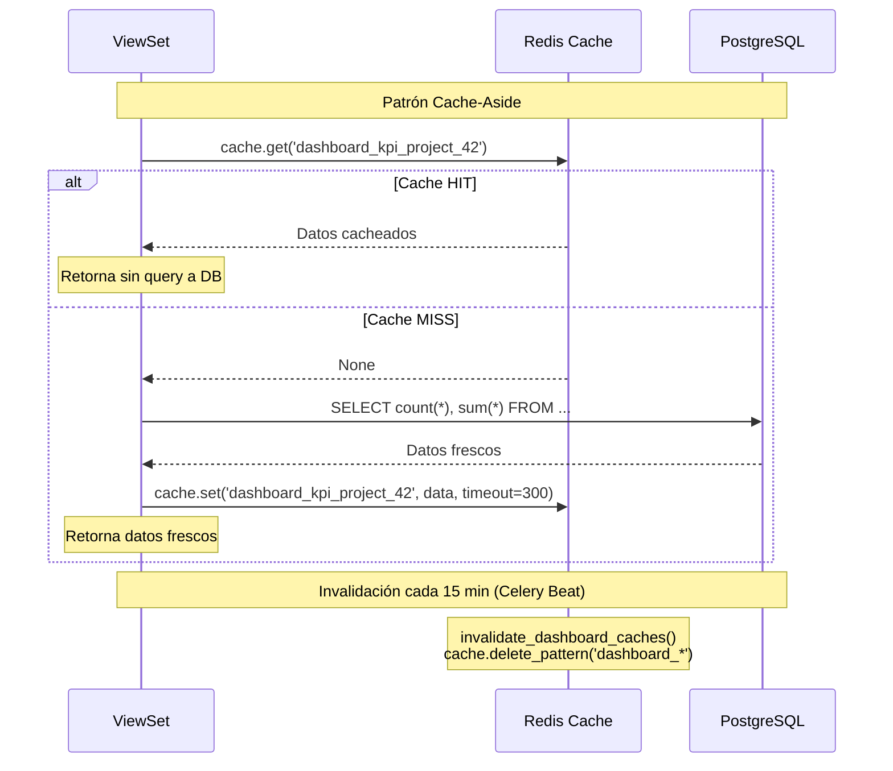

---

## 9. Modelo de Datos — Relaciones Detalladas

### 9.1 Diagrama ER Completo

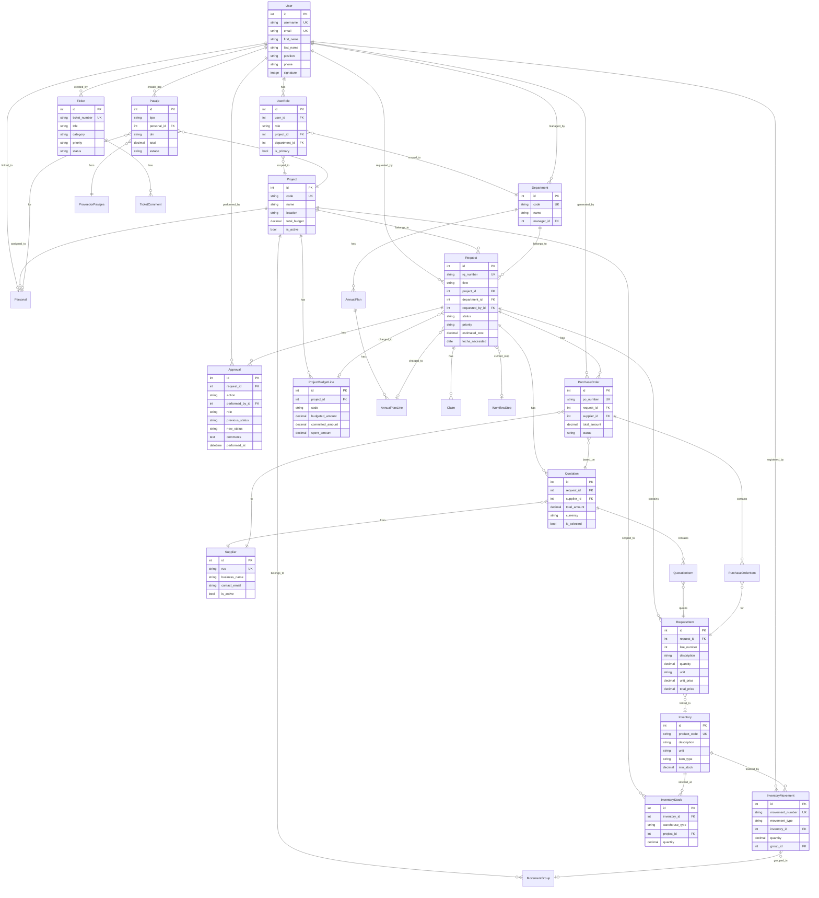

---

## 10. Rate Limiting y Throttling

```mermaid
graph TB
    subgraph "Configuración de Throttle"
        subgraph "Desarrollo"
            DEV_ANON["Anónimo: 300/min"]
            DEV_AUTH["Autenticado: 1000/min"]
            DEV_LOGIN["Login: 30/min"]
        end

        subgraph "Producción"
            PROD_ANON["Anónimo: 30/min"]
            PROD_AUTH["Autenticado: 200/min"]
            PROD_LOGIN["Login: 5/min"]
        end
    end

    subgraph "Flujo de Verificación"
        REQ2["Request entrante"]
        CHECK["DRF Throttle Check<br/>AnonRateThrottle<br/>UserRateThrottle"]
        CACHE2["Redis Cache<br/>Almacena conteo<br/>por IP/user"]
        PASS["✅ Pasa<br/>Continúa a View"]
        BLOCK["❌ 429 Too Many Requests<br/>Retry-After header"]
    end

    REQ2 --> CHECK
    CHECK --> CACHE2
    CACHE2 -->|Bajo límite| PASS
    CACHE2 -->|Sobre límite| BLOCK
```

---

*Documento generado para SYSPCC v1.0 — PCC Ingeniería y Construcción*
*Última actualización: Abril 2026*
