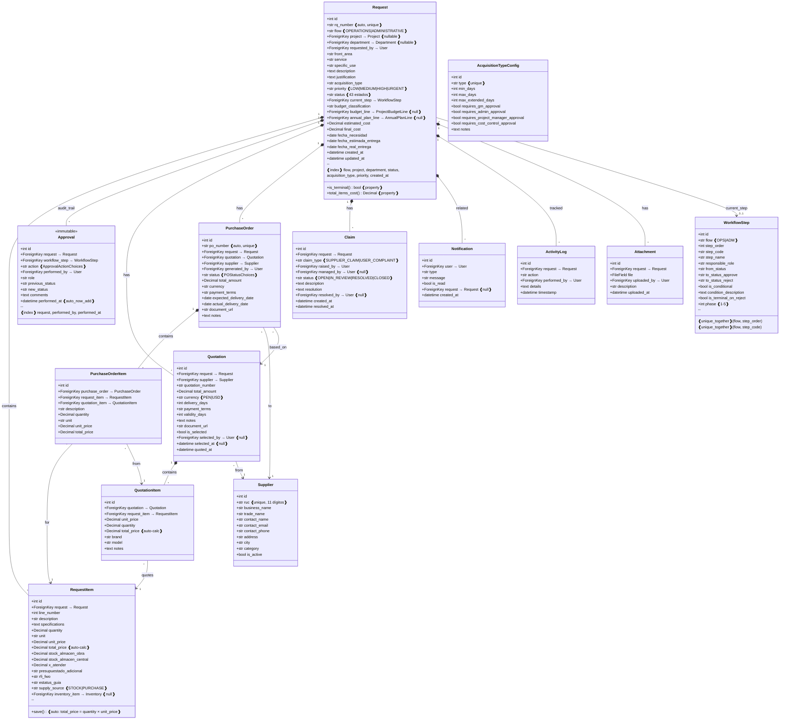
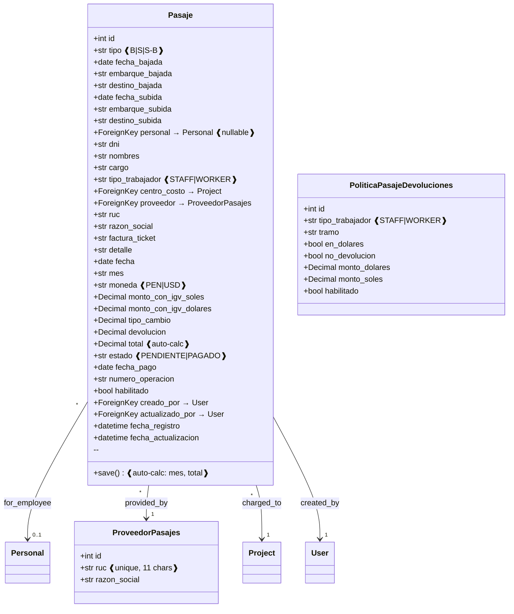
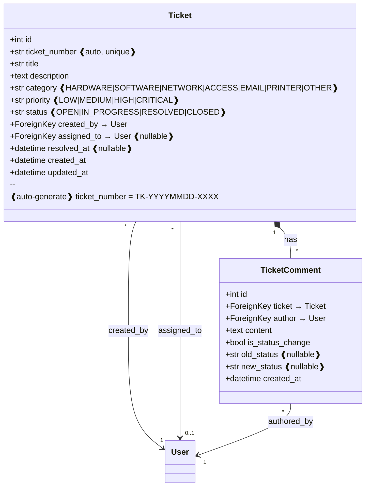
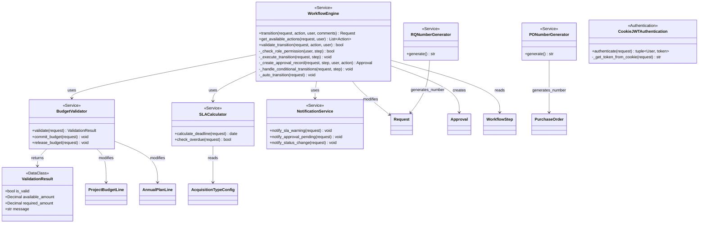
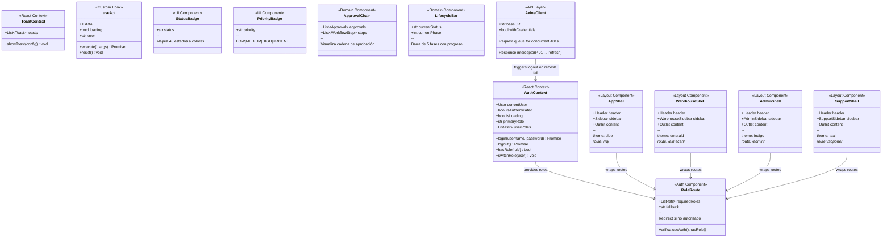
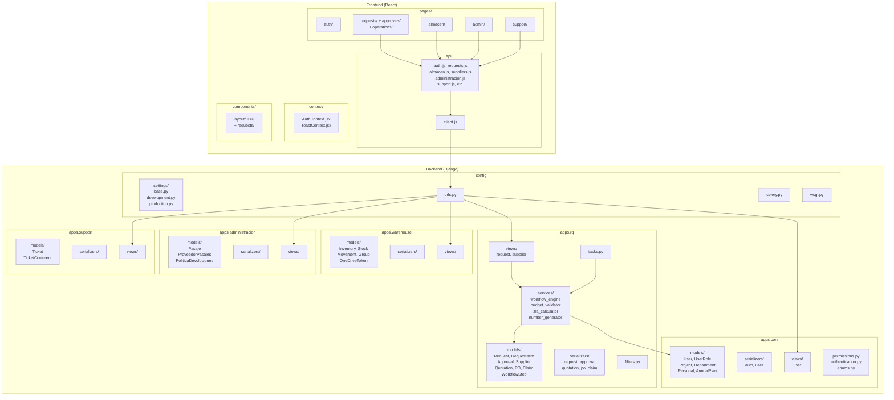

# SYSPCC — Diagrama de Clases

**Sistema de Gestión de Requerimientos de Abastecimiento**
**Versión:** 1.0 | **Fecha:** Abril 2026 | **Empresa:** PCC Ingeniería y Construcción

---

## 1. Diagrama de Clases Completo — Módulo Core

```mermaid
classDiagram
    direction TB

    class User {
        <<Django AbstractUser>>
        +int id
        +str username
        +str email ❰unique❱
        +str first_name
        +str last_name
        +str position
        +str department
        +str phone
        +str avatar_url
        +ImageField signature
        +datetime date_joined
        +bool is_active
        +bool is_staff
        --
        +get_roles() List~str~
        +has_role(role: str) bool
    }

    class UserRole {
        +int id
        +ForeignKey user → User
        +str role ❰RoleChoices❱
        +ForeignKey project → Project ❰nullable❱
        +ForeignKey department_obj → Department ❰nullable❱
        +bool is_primary
        +datetime assigned_at
        --
        ❰unique_together❱ (user, role, project, department_obj)
    }

    class RoleChoices {
        <<enumeration>>
        REQUESTER
        PROJECT_RESIDENT
        PROJECT_CONTROL
        GENERAL_MANAGER
        LOGISTICS_COORDINATOR
        CENTRAL_WAREHOUSE
        SITE_WAREHOUSE
        DIRECT_SUPERVISOR
        ADMIN_MANAGER
        LOGISTICS_SUPERVISOR
        LOGISTICS_CHIEF
    }

    class Project {
        +int id
        +str code ❰unique❱
        +str name
        +str location
        +str client
        +str frente
        +Decimal total_budget
        +date start_date
        +date end_date
        +bool is_active
    }

    class ProjectBudgetLine {
        +int id
        +ForeignKey project → Project
        +str code
        +str description
        +Decimal budgeted_amount
        +Decimal committed_amount
        +Decimal spent_amount
        --
        +available_amount() Decimal ❰property❱
        ❰unique_together❱ (project, code)
    }

    class Department {
        +int id
        +str code ❰unique❱
        +str name
        +str frente
        +ForeignKey manager → User
        +bool is_active
    }

    class AnnualPlan {
        +int id
        +int year
        +ForeignKey department → Department
        +Decimal total_budget
        +ForeignKey approved_by → User
        +datetime approved_at
        +bool is_active
        --
        ❰unique_together❱ (year, department)
    }

    class AnnualPlanLine {
        +int id
        +ForeignKey annual_plan → AnnualPlan
        +str code
        +str description
        +str category
        +Decimal budgeted_amount
        +Decimal committed_amount
        +Decimal spent_amount
        --
        +available_amount() Decimal ❰property❱
        ❰unique_together❱ (annual_plan, code)
    }

    class Personal {
        +int id
        +str dni ❰unique❱
        +str apellidos_nombres
        +date fecha_nacimiento
        +str sexo
        +str estado_civil
        +str celular
        +str email_personal
        +str estado ❰ACTIVO|CESADO|VACACIONES|LICENCIA❱
        +date fecha_ingreso
        +date fecha_cese
        +str motivo_cese
        +ForeignKey proyecto → Project
        +str sede
        +str puesto
        +str guardia
        +str condicion_trabajo
        +Decimal salario
        +str sistema_pensiones
        +str entidad_bancaria
        +str numero_cuenta
        +str cci
        +bool tiene_hijos
        +int cantidad_hijos_menores
        +bool asignacion_familiar
        +str numero_fotocheck
        +str talla_zapato
        +str talla_pantalon
        +str talla_camisa
        +OneToOneField user → User ❰nullable❱
        --
        +edad() int ❰property❱
    }

    User "1" --> "*" UserRole : has
    UserRole --> RoleChoices : uses
    UserRole "*" --> "0..1" Project : scoped_to
    UserRole "*" --> "0..1" Department : scoped_to
    Project "1" --> "*" ProjectBudgetLine : has
    Department "1" --> "*" AnnualPlan : has
    AnnualPlan "1" --> "*" AnnualPlanLine : has
    Department "*" --> "1" User : managed_by
    Personal "0..1" --> "0..1" User : linked_to
    Personal "*" --> "0..1" Project : assigned_to
    AnnualPlan "*" --> "0..1" User : approved_by
```



---

## 2. Diagrama de Clases — Módulo RQ (Requerimientos)



---

## 3. Diagrama de Clases — Módulo Almacén

```mermaid
classDiagram
    direction TB

    class Inventory {
        +int id
        +str product_code ❰unique❱
        +str description
        +str unit
        +str category
        +str item_type ❰EQUIPMENT|CONSUMABLE|TOOL|MATERIAL❱
        +str brand
        +str model_name
        +str location
        +Decimal min_stock
        +datetime created_at
        +datetime updated_at
    }

    class InventoryStock {
        +int id
        +ForeignKey inventory → Inventory
        +str warehouse_type ❰CENTRAL|SITE|OFFICE❱
        +ForeignKey project → Project
        +ForeignKey department → Department
        +Decimal quantity
        +datetime last_updated
        --
        ❰unique_together❱ (inventory, warehouse_type,
                           project, department)
    }

    class MovementGroup {
        +int id
        +str group_number ❰unique❱
        +str movement_type
        +str warehouse
        +ForeignKey project → Project
        +str source_type
        +str supplier_name
        +str invoice_number
        +str destination_type
        +str destination_detail
        +text notes
        +str document_url
        +ForeignKey registered_by → User
        +datetime created_at
    }

    class InventoryMovement {
        +int id
        +str movement_number ❰unique❱
        +str movement_type ❰ENTRY|EXIT|TRANSFER|ADJUSTMENT❱
        +ForeignKey inventory → Inventory
        +Decimal quantity
        +str warehouse ❰CENTRAL|SITE|OFFICE❱
        +ForeignKey project → Project
        +str source_type
        +str supplier_name
        +str invoice_number
        +str destination_type
        +str destination_detail
        +ForeignKey requested_by → User
        +ForeignKey authorized_by → User
        +ForeignKey group → MovementGroup ❰null❱
        +text notes
        +str document_url
        +ForeignKey registered_by → User
        +datetime created_at
        --
        ❰index❱ (inventory, -created_at)
        ❰index❱ (movement_type, -created_at)
        ❰index❱ (warehouse, -created_at)
    }

    class WarehouseReceipt {
        +int id
        +ForeignKey request → Request
        +ForeignKey purchase_order → PurchaseOrder
        +str receipt_number
        +ForeignKey received_by → User
        +datetime received_at
        +text notes
        +str status ❰PENDING|APPROVED|REJECTED❱
    }

    class OneDriveToken {
        +int id
        +str access_token
        +str refresh_token
        +datetime expires_at
    }

    Inventory "1" *-- "*" InventoryStock : stocked_at
    Inventory "1" *-- "*" InventoryMovement : tracked_by
    MovementGroup "1" *-- "*" InventoryMovement : groups
    InventoryStock "*" --> "1" Project : scoped
    InventoryMovement "*" --> "0..1" Project : for
```

---

## 4. Diagrama de Clases — Módulo Administración



---

## 5. Diagrama de Clases — Módulo Soporte TI



---

## 6. Diagrama de Clases — Servicios de Negocio



---

## 7. Diagrama de Clases — Frontend (React Components)



---

## 8. Diagrama de Paquetes — Vista General



---

*Documento generado para SYSPCC v1.0 — PCC Ingeniería y Construcción*
*Última actualización: Abril 2026*
