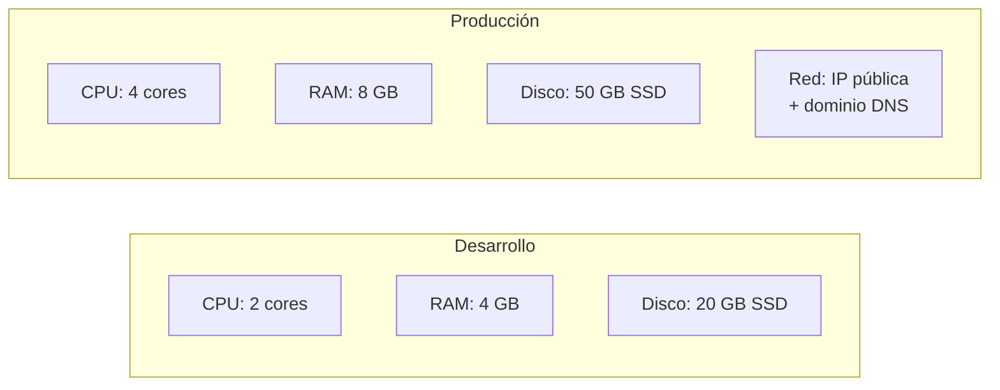
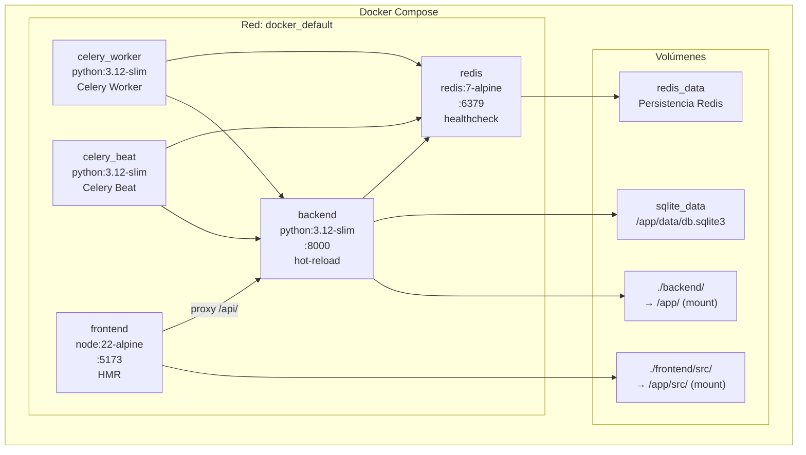
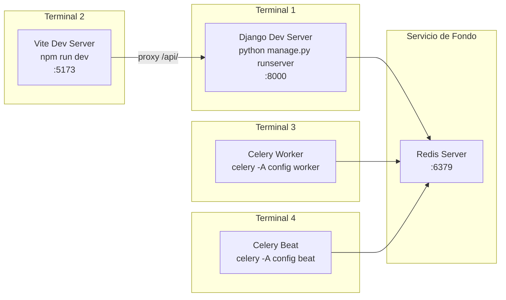
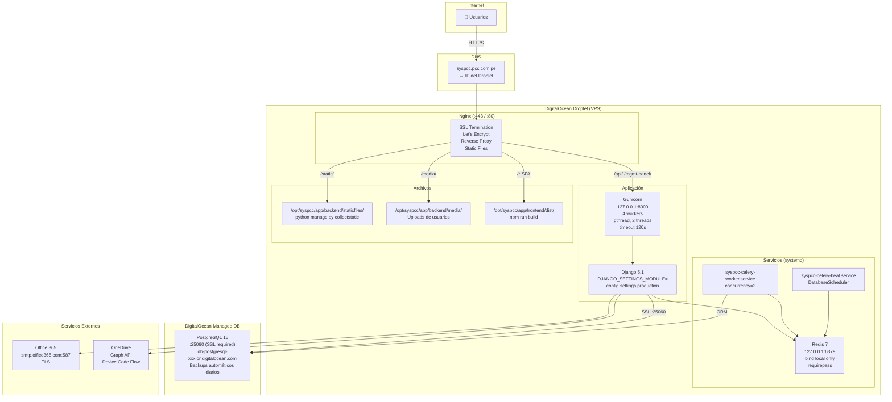
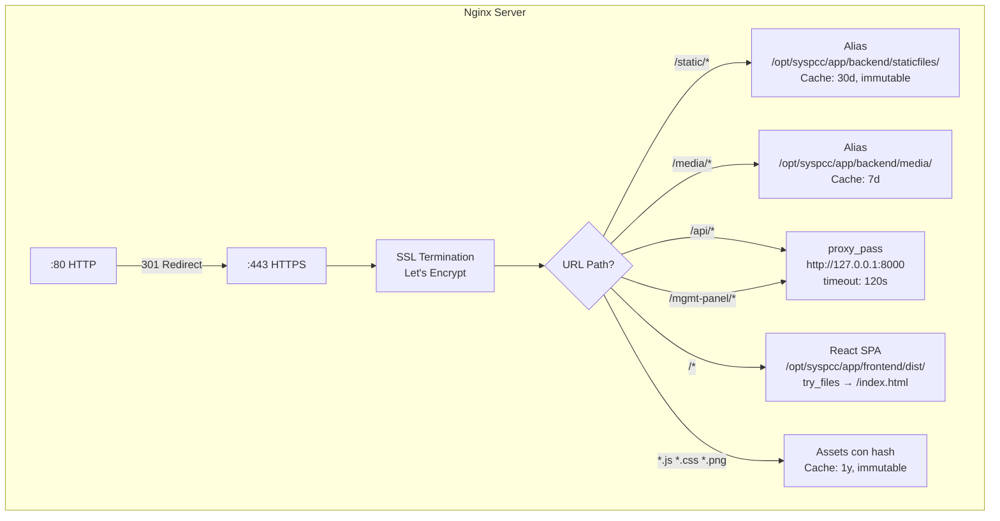
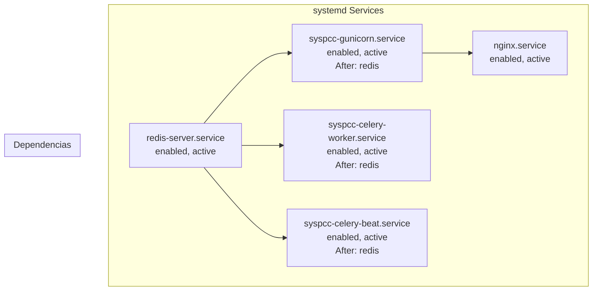
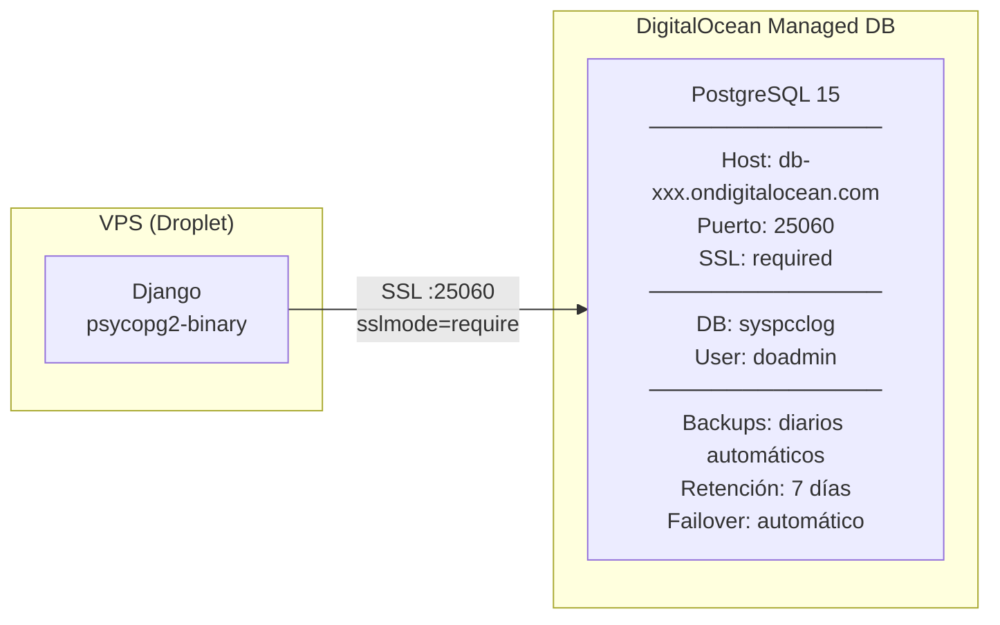
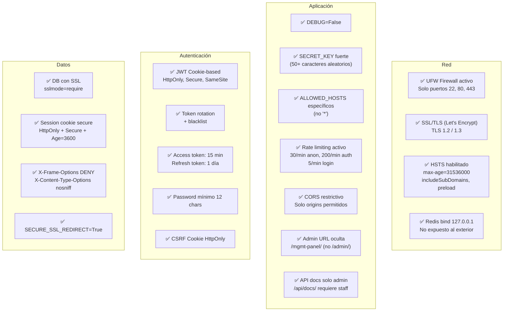
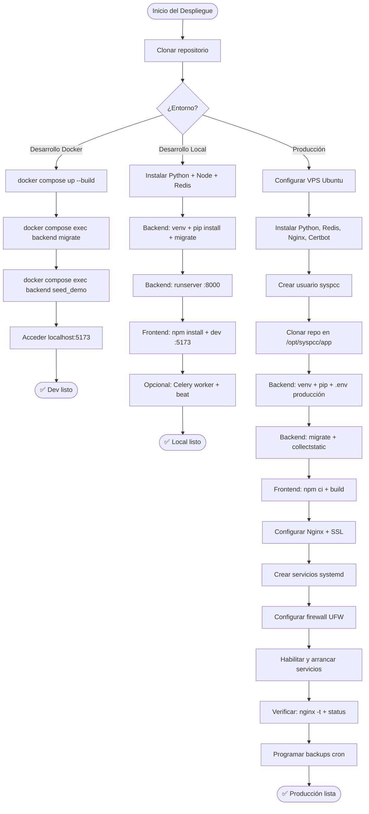
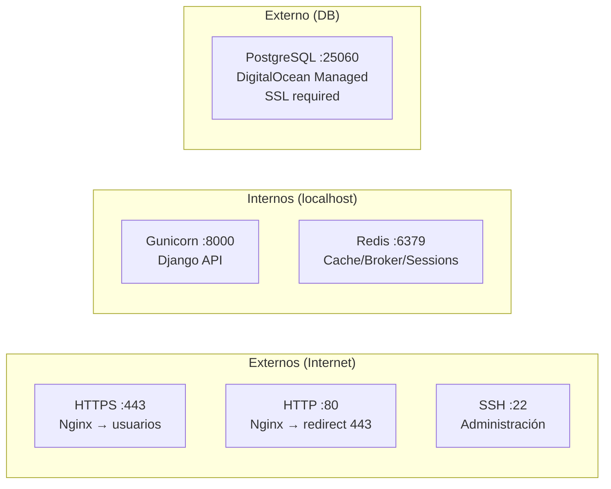

# SYSPCC — Guía de Despliegue y Manual de Producción

**Sistema de Gestión de Requerimientos de Abastecimiento**
**Versión:** 1.0 | **Fecha:** Abril 2026 | **Empresa:** PCC Ingeniería y Construcción

---

## Tabla de Contenidos

1. [Requisitos del Sistema](#1-requisitos-del-sistema)
2. [Despliegue en Desarrollo (Docker)](#2-despliegue-en-desarrollo-docker)
3. [Despliegue en Desarrollo (Local)](#3-despliegue-en-desarrollo-local)
4. [Despliegue en Producción](#4-despliegue-en-producción)
5. [Configuración de Nginx](#5-configuración-de-nginx)
6. [Configuración de Servicios (systemd)](#6-configuración-de-servicios-systemd)
7. [Base de Datos](#7-base-de-datos)
8. [Backup y Restauración](#8-backup-y-restauración)
9. [Monitoreo y Logs](#9-monitoreo-y-logs)
10. [Seguridad](#10-seguridad)
11. [Mantenimiento](#11-mantenimiento)
12. [Troubleshooting](#12-troubleshooting)
13. [Variables de Entorno](#13-variables-de-entorno)

---

## 1. Requisitos del Sistema

### 1.1 Hardware



### 1.2 Software

| Software | Versión | Propósito |
|----------|---------|-----------|
| Ubuntu Server | 22.04 LTS+ | Sistema operativo del servidor |
| Python | 3.12+ | Runtime del backend Django |
| Node.js | 22 LTS | Build del frontend React |
| PostgreSQL | 15+ | Base de datos (DigitalOcean Managed) |
| Redis | 7+ | Cache, broker Celery, sesiones |
| Nginx | 1.24+ | Reverse proxy, SSL, archivos estáticos |
| Certbot | Latest | Certificados SSL Let's Encrypt |
| Git | 2.40+ | Control de versiones |
| Docker | 24+ | Contenedores (solo desarrollo) |
| Docker Compose | 2.20+ | Orquestación (solo desarrollo) |

### 1.3 Dependencias Python (requirements.txt)

| Paquete | Versión | Función |
|---------|---------|---------|
| Django | 5.1.4 | Framework web backend |
| djangorestframework | 3.15.2 | API REST |
| djangorestframework-simplejwt | 5.3.1 | Autenticación JWT |
| psycopg2-binary | 2.9.10 | Driver PostgreSQL |
| django-redis | 5.4.0 | Cache Redis |
| redis | 5.2.1 | Cliente Redis |
| celery | 5.4.0 | Tareas asíncronas |
| django-celery-beat | 2.7.0 | Tareas programadas |
| gunicorn | 23.0.0 | Servidor WSGI producción |
| django-cors-headers | 4.6.0 | CORS |
| django-filter | 24.3 | Filtros DRF |
| drf-spectacular | 0.27.2 | OpenAPI/Swagger docs |
| pandas | 2.2.3 | Procesamiento Excel |
| openpyxl | 3.1.5 | Lectura/escritura Excel |
| Pillow | 11.0.0 | Procesamiento de imágenes |
| python-magic | 0.4.27 | Detección tipo de archivo |
| reportlab | 4.2.5 | Generación de PDFs |
| python-decouple | 3.8 | Variables de entorno |
| requests | 2.32.3 | HTTP client (OneDrive) |
| pytest | 8.3.4 | Testing |
| pytest-django | 4.9.0 | Testing Django |
| factory-boy | 3.3.1 | Test factories |

### 1.4 Dependencias Frontend (package.json)

| Paquete | Versión | Función |
|---------|---------|---------|
| react | 19.2.4 | Framework UI |
| react-dom | 19.2.4 | Renderizado DOM |
| react-router-dom | 7.13.1 | Routing SPA |
| axios | 1.7.9 | HTTP client |
| lucide-react | 0.577.0 | Iconos |
| exceljs | 4.4.0 | Exportación Excel |
| file-saver | 2.0.5 | Descarga de archivos |
| vite | 7.3.1 | Build tool |
| tailwindcss | 4.2.1 | Framework CSS |

---

## 2. Despliegue en Desarrollo (Docker)

### 2.1 Arquitectura Docker



### 2.2 Pasos de Despliegue

```bash
# 1. Clonar repositorio
git clone https://github.com/pccpegit/syspcc-platform.git
cd syspcc-platform

# 2. Verificar archivo de configuración Docker
cat .env.docker
# Contiene: SECRET_KEY, DJANGO_SETTINGS_MODULE, REDIS_URL, etc.

# 3. Levantar todos los servicios
docker compose --env-file .env.docker up --build

# 4. En otra terminal: inicializar base de datos
docker compose exec backend python manage.py migrate
docker compose exec backend python manage.py seed_demo

# 5. Crear superusuario (opcional)
docker compose exec backend python manage.py createsuperuser

# 6. Acceder al sistema
# Frontend:    http://localhost:5173
# Backend API: http://localhost:8000/api/v1/
# Admin panel: http://localhost:8000/mgmt-panel/
# API Docs:    http://localhost:8000/api/docs/
```

### 2.3 Comandos Docker útiles

```bash
# Ver logs de todos los servicios
docker compose logs -f

# Ver logs de un servicio específico
docker compose logs -f backend
docker compose logs -f celery_worker

# Ejecutar comando en el backend
docker compose exec backend python manage.py shell
docker compose exec backend python manage.py showmigrations

# Reiniciar un servicio
docker compose restart backend
docker compose restart celery_worker

# Detener todo
docker compose down

# Detener y eliminar volúmenes (BORRA DATOS)
docker compose down -v

# Rebuild tras cambios en requirements.txt o Dockerfile
docker compose up --build
```

---

## 3. Despliegue en Desarrollo (Local)

### 3.1 Diagrama de Servicios Locales



### 3.2 Pasos de Instalación

```bash
# ============================================
# PREREQUISITOS (macOS)
# ============================================
brew install python@3.12 node redis
brew services start redis

# ============================================
# PREREQUISITOS (Ubuntu)
# ============================================
sudo apt install python3.12 python3.12-venv python3.12-dev
sudo apt install nodejs npm redis-server libmagic1
sudo systemctl start redis-server

# ============================================
# BACKEND
# ============================================
cd backend/

# Crear entorno virtual
python3.12 -m venv venv
source venv/bin/activate  # Linux/macOS
# venv\Scripts\activate   # Windows

# Instalar dependencias
pip install -r requirements.txt

# Configurar variables de entorno
cp .env.example .env
# Editar .env con valores locales (ver sección 13)

# Migraciones
DJANGO_SETTINGS_MODULE=config.settings.development python manage.py migrate

# Cargar datos demo
DJANGO_SETTINGS_MODULE=config.settings.development python manage.py seed_demo

# Iniciar servidor Django
DJANGO_SETTINGS_MODULE=config.settings.development python manage.py runserver

# ============================================
# FRONTEND (en otra terminal)
# ============================================
cd frontend/

# Instalar dependencias
npm install

# Iniciar servidor Vite
npm run dev
# → Accesible en http://localhost:5173
# → Proxy de /api/ hacia http://localhost:8000

# ============================================
# CELERY (opcional, en 2 terminales adicionales)
# ============================================
cd backend/
source venv/bin/activate

# Terminal 3: Worker
celery -A config worker -l info

# Terminal 4: Beat (tareas programadas)
celery -A config beat -l info --scheduler django_celery_beat.schedulers:DatabaseScheduler
```

---

## 4. Despliegue en Producción

### 4.1 Arquitectura de Producción



### 4.2 Preparación del Servidor

```bash
# ====================================================
# PASO 1: Configuración inicial del VPS
# ====================================================
sudo apt update && sudo apt upgrade -y

# Instalar dependencias del sistema
sudo apt install -y \
    python3.12 python3.12-venv python3.12-dev \
    nginx certbot python3-certbot-nginx \
    redis-server \
    git curl build-essential \
    libpq-dev libmagic1

# Crear usuario de aplicación (sin login interactivo)
sudo adduser --system --group --home /opt/syspcc syspcc

# Crear directorios necesarios
sudo mkdir -p /var/log/syspcc
sudo chown syspcc:syspcc /var/log/syspcc
sudo mkdir -p /opt/syspcc/backups
sudo chown syspcc:syspcc /opt/syspcc/backups
```

### 4.3 Despliegue del Backend

```bash
# ====================================================
# PASO 2: Código y entorno virtual
# ====================================================
sudo -u syspcc git clone https://github.com/pccpegit/syspcc-platform.git /opt/syspcc/app
cd /opt/syspcc/app/backend

# Crear entorno virtual
sudo -u syspcc python3.12 -m venv /opt/syspcc/venv
source /opt/syspcc/venv/bin/activate

# Instalar dependencias
pip install -r requirements.txt

# ====================================================
# PASO 3: Variables de entorno de producción
# ====================================================
sudo nano /opt/syspcc/app/backend/.env
```

Contenido del archivo `.env` de producción:

```ini
# === Django ===
SECRET_KEY=<clave-aleatoria-50-caracteres-usar-python-secrets>
DJANGO_SETTINGS_MODULE=config.settings.production
DJANGO_ENV=production
DEBUG=False
ALLOWED_HOSTS=syspcc.pcc.com.pe,www.syspcc.pcc.com.pe

# === Base de Datos (DigitalOcean Managed PostgreSQL) ===
DB_ENGINE=django.db.backends.postgresql
DB_NAME=syspcclog
DB_USER=doadmin
DB_PASSWORD=<contraseña-de-digitalocean>
DB_HOST=db-postgresql-nyc3-xxxxx.ondigitalocean.com
DB_PORT=25060

# === Redis ===
REDIS_URL=redis://:redis-password@127.0.0.1:6379/0
CELERY_BROKER_URL=redis://:redis-password@127.0.0.1:6379/1
CELERY_RESULT_BACKEND=redis://:redis-password@127.0.0.1:6379/2

# === CORS ===
CORS_ALLOWED_ORIGINS=https://syspcc.pcc.com.pe

# === Email (Office 365) ===
EMAIL_BACKEND=django.core.mail.backends.smtp.EmailBackend
EMAIL_HOST=smtp.office365.com
EMAIL_PORT=587
EMAIL_HOST_USER=sistemas@pcc.com.pe
EMAIL_HOST_PASSWORD=<contraseña-email>
DEFAULT_FROM_EMAIL=sistemas@pcc.com.pe

# === Seguridad ===
SECURE_SSL_REDIRECT=True
```

```bash
# ====================================================
# PASO 4: Inicializar la base de datos
# ====================================================
cd /opt/syspcc/app/backend
source /opt/syspcc/venv/bin/activate

# Ejecutar migraciones
python manage.py migrate

# Recolectar archivos estáticos
python manage.py collectstatic --noinput

# Crear superusuario
python manage.py createsuperuser

# Verificar que funciona
python manage.py check --deploy
```

### 4.4 Build del Frontend

```bash
# ====================================================
# PASO 5: Build de producción del frontend
# ====================================================
cd /opt/syspcc/app/frontend

# Instalar Node.js 22 si no está instalado
curl -fsSL https://deb.nodesource.com/setup_22.x | sudo -E bash -
sudo apt install -y nodejs

# Instalar dependencias
npm ci

# Configurar URL de API
echo "VITE_API_URL=/api/v1/" > .env.production

# Build de producción
npm run build
# → Los archivos quedan en /opt/syspcc/app/frontend/dist/
```

---

## 5. Configuración de Nginx

### 5.1 Diagrama de Routing de Nginx



### 5.2 Archivo de Configuración

Crear archivo `/etc/nginx/sites-available/syspcc`:

```nginx
# Redirect HTTP → HTTPS
server {
    listen 80;
    listen [::]:80;
    server_name syspcc.pcc.com.pe;
    return 301 https://$server_name$request_uri;
}

server {
    listen 443 ssl http2;
    listen [::]:443 ssl http2;
    server_name syspcc.pcc.com.pe;

    # === SSL (Let's Encrypt) ===
    ssl_certificate /etc/letsencrypt/live/syspcc.pcc.com.pe/fullchain.pem;
    ssl_certificate_key /etc/letsencrypt/live/syspcc.pcc.com.pe/privkey.pem;
    ssl_protocols TLSv1.2 TLSv1.3;
    ssl_ciphers HIGH:!aNULL:!MD5;
    ssl_prefer_server_ciphers on;
    ssl_session_cache shared:SSL:10m;
    ssl_session_timeout 10m;

    # === Headers de Seguridad ===
    add_header X-Frame-Options "DENY" always;
    add_header X-Content-Type-Options "nosniff" always;
    add_header X-XSS-Protection "1; mode=block" always;
    add_header Strict-Transport-Security "max-age=31536000; includeSubDomains; preload" always;
    add_header Referrer-Policy "strict-origin-when-cross-origin" always;

    # === Límites ===
    client_max_body_size 20M;

    # === Logs ===
    access_log /var/log/nginx/syspcc-access.log;
    error_log /var/log/nginx/syspcc-error.log;

    # === Archivos estáticos de Django ===
    location /static/ {
        alias /opt/syspcc/app/backend/staticfiles/;
        expires 30d;
        add_header Cache-Control "public, immutable";
        access_log off;
    }

    # === Archivos media (uploads) ===
    location /media/ {
        alias /opt/syspcc/app/backend/media/;
        expires 7d;
        add_header Cache-Control "public";
    }

    # === API Backend (Gunicorn) ===
    location /api/ {
        proxy_pass http://127.0.0.1:8000;
        proxy_set_header Host $host;
        proxy_set_header X-Real-IP $remote_addr;
        proxy_set_header X-Forwarded-For $proxy_add_x_forwarded_for;
        proxy_set_header X-Forwarded-Proto $scheme;
        proxy_read_timeout 120s;
        proxy_connect_timeout 10s;
    }

    # === Panel de Administración Django ===
    location /mgmt-panel/ {
        proxy_pass http://127.0.0.1:8000;
        proxy_set_header Host $host;
        proxy_set_header X-Real-IP $remote_addr;
        proxy_set_header X-Forwarded-For $proxy_add_x_forwarded_for;
        proxy_set_header X-Forwarded-Proto $scheme;
    }

    # === React SPA (frontend) ===
    location / {
        root /opt/syspcc/app/frontend/dist;
        index index.html;
        try_files $uri $uri/ /index.html;

        # Cache agresivo para assets con hash
        location ~* \.(js|css|png|jpg|jpeg|gif|ico|svg|woff|woff2|ttf|eot)$ {
            expires 1y;
            add_header Cache-Control "public, immutable";
            access_log off;
        }
    }
}
```

### 5.3 Activar y verificar

```bash
# Crear symlink
sudo ln -s /etc/nginx/sites-available/syspcc /etc/nginx/sites-enabled/

# Eliminar default
sudo rm -f /etc/nginx/sites-enabled/default

# Verificar configuración
sudo nginx -t

# Recargar Nginx
sudo systemctl reload nginx

# Obtener certificado SSL
sudo certbot --nginx -d syspcc.pcc.com.pe
# Certbot agrega automáticamente renovación vía cron/timer
```

---

## 6. Configuración de Servicios (systemd)

### 6.1 Diagrama de Servicios



### 6.2 Gunicorn Service

Crear `/etc/systemd/system/syspcc-gunicorn.service`:

```ini
[Unit]
Description=SYSPCC Gunicorn Application Server
After=network.target redis-server.service
Requires=redis-server.service

[Service]
User=syspcc
Group=syspcc
WorkingDirectory=/opt/syspcc/app/backend
EnvironmentFile=/opt/syspcc/app/backend/.env
ExecStart=/opt/syspcc/venv/bin/gunicorn config.wsgi:application \
    --bind 127.0.0.1:8000 \
    --workers 4 \
    --worker-class gthread \
    --threads 2 \
    --timeout 120 \
    --graceful-timeout 30 \
    --max-requests 1000 \
    --max-requests-jitter 50 \
    --access-logfile /var/log/syspcc/gunicorn-access.log \
    --error-logfile /var/log/syspcc/gunicorn-error.log \
    --capture-output
Restart=on-failure
RestartSec=5

[Install]
WantedBy=multi-user.target
```

### 6.3 Celery Worker Service

Crear `/etc/systemd/system/syspcc-celery-worker.service`:

```ini
[Unit]
Description=SYSPCC Celery Worker
After=network.target redis-server.service
Requires=redis-server.service

[Service]
User=syspcc
Group=syspcc
WorkingDirectory=/opt/syspcc/app/backend
EnvironmentFile=/opt/syspcc/app/backend/.env
ExecStart=/opt/syspcc/venv/bin/celery -A config worker \
    --loglevel=info \
    --concurrency=2 \
    --logfile=/var/log/syspcc/celery-worker.log \
    --pidfile=/tmp/syspcc-celery-worker.pid
Restart=on-failure
RestartSec=10
KillSignal=SIGTERM
TimeoutStopSec=30

[Install]
WantedBy=multi-user.target
```

### 6.4 Celery Beat Service

Crear `/etc/systemd/system/syspcc-celery-beat.service`:

```ini
[Unit]
Description=SYSPCC Celery Beat Scheduler
After=network.target redis-server.service
Requires=redis-server.service

[Service]
User=syspcc
Group=syspcc
WorkingDirectory=/opt/syspcc/app/backend
EnvironmentFile=/opt/syspcc/app/backend/.env
ExecStart=/opt/syspcc/venv/bin/celery -A config beat \
    --loglevel=info \
    --scheduler django_celery_beat.schedulers:DatabaseScheduler \
    --logfile=/var/log/syspcc/celery-beat.log \
    --pidfile=/tmp/syspcc-celery-beat.pid
Restart=on-failure
RestartSec=10

[Install]
WantedBy=multi-user.target
```

### 6.5 Activar servicios

```bash
# Recargar systemd
sudo systemctl daemon-reload

# Habilitar servicios (inicio automático)
sudo systemctl enable redis-server
sudo systemctl enable syspcc-gunicorn
sudo systemctl enable syspcc-celery-worker
sudo systemctl enable syspcc-celery-beat

# Iniciar servicios
sudo systemctl start redis-server
sudo systemctl start syspcc-gunicorn
sudo systemctl start syspcc-celery-worker
sudo systemctl start syspcc-celery-beat

# Verificar estado
sudo systemctl status syspcc-gunicorn
sudo systemctl status syspcc-celery-worker
sudo systemctl status syspcc-celery-beat
```

---

## 7. Base de Datos

### 7.1 Configuración de PostgreSQL (DigitalOcean)



### 7.2 Migraciones

```bash
# Ver estado de migraciones
python manage.py showmigrations

# Aplicar migraciones pendientes
python manage.py migrate

# Crear nueva migración después de cambiar modelos
python manage.py makemigrations <app_name>

# Ver SQL de una migración específica
python manage.py sqlmigrate <app_name> <migration_number>
```

### 7.3 Conexión manual a la base de datos

```bash
# Desde el servidor VPS
PGPASSWORD=$DB_PASSWORD psql \
    -h $DB_HOST \
    -p $DB_PORT \
    -U $DB_USER \
    -d $DB_NAME \
    "sslmode=require"
```

---

## 8. Backup y Restauración

### 8.1 Script de Backup

Crear `/opt/syspcc/scripts/backup-db.sh`:

```bash
#!/bin/bash
set -e

# Configuración
source /opt/syspcc/app/backend/.env
TIMESTAMP=$(date +%Y%m%d_%H%M%S)
BACKUP_DIR="/opt/syspcc/backups"
RETENTION_DAYS=30

mkdir -p $BACKUP_DIR

echo "[$(date)] Iniciando backup..."

# Backup de la base de datos
PGPASSWORD=$DB_PASSWORD pg_dump \
    -h $DB_HOST \
    -p $DB_PORT \
    -U $DB_USER \
    -d $DB_NAME \
    --format=custom \
    --compress=9 \
    -f "$BACKUP_DIR/syspcc_db_$TIMESTAMP.dump"

# Backup de archivos media
tar -czf "$BACKUP_DIR/syspcc_media_$TIMESTAMP.tar.gz" \
    -C /opt/syspcc/app/backend media/

# Eliminar backups antiguos
find $BACKUP_DIR -name "*.dump" -mtime +$RETENTION_DAYS -delete
find $BACKUP_DIR -name "*.tar.gz" -mtime +$RETENTION_DAYS -delete

echo "[$(date)] Backup completado: syspcc_db_$TIMESTAMP.dump"
echo "[$(date)] Media backup: syspcc_media_$TIMESTAMP.tar.gz"
```

```bash
# Hacer ejecutable
chmod +x /opt/syspcc/scripts/backup-db.sh

# Programar backup diario a las 3:00 AM
sudo crontab -e
# Agregar línea:
0 3 * * * /opt/syspcc/scripts/backup-db.sh >> /var/log/syspcc/backup.log 2>&1
```

### 8.2 Restauración

```bash
# Restaurar base de datos desde backup
PGPASSWORD=$DB_PASSWORD pg_restore \
    -h $DB_HOST \
    -p $DB_PORT \
    -U $DB_USER \
    -d $DB_NAME \
    --clean \
    --if-exists \
    /opt/syspcc/backups/syspcc_db_YYYYMMDD_HHMMSS.dump

# Restaurar archivos media
tar -xzf /opt/syspcc/backups/syspcc_media_YYYYMMDD_HHMMSS.tar.gz \
    -C /opt/syspcc/app/backend/
```

---

## 9. Monitoreo y Logs

### 9.1 Ubicación de Logs

| Servicio | Archivo de Log |
|----------|---------------|
| Nginx access | `/var/log/nginx/syspcc-access.log` |
| Nginx error | `/var/log/nginx/syspcc-error.log` |
| Gunicorn access | `/var/log/syspcc/gunicorn-access.log` |
| Gunicorn error | `/var/log/syspcc/gunicorn-error.log` |
| Celery Worker | `/var/log/syspcc/celery-worker.log` |
| Celery Beat | `/var/log/syspcc/celery-beat.log` |
| Backup | `/var/log/syspcc/backup.log` |
| systemd (todos) | `journalctl -u <service-name>` |

### 9.2 Comandos de Monitoreo

```bash
# === Estado de servicios ===
sudo systemctl status syspcc-gunicorn
sudo systemctl status syspcc-celery-worker
sudo systemctl status syspcc-celery-beat
sudo systemctl status redis-server
sudo systemctl status nginx

# === Logs en tiempo real ===
# Gunicorn
sudo journalctl -u syspcc-gunicorn -f

# Celery Worker
sudo journalctl -u syspcc-celery-worker -f
tail -f /var/log/syspcc/celery-worker.log

# Nginx
tail -f /var/log/nginx/syspcc-error.log

# Todos los logs de syspcc
tail -f /var/log/syspcc/*.log

# === Uso de recursos ===
htop
df -h                    # Disco
free -m                  # Memoria
redis-cli info memory    # Memoria Redis

# === Conexiones activas ===
sudo ss -tlnp            # Puertos abiertos
sudo ss -s               # Resumen de sockets

# === Verificar estado de Redis ===
redis-cli ping           # Debe responder PONG
redis-cli info keyspace  # Bases de datos en uso
redis-cli dbsize         # Cantidad de keys
```

### 9.3 Rotación de Logs

Crear `/etc/logrotate.d/syspcc`:

```
/var/log/syspcc/*.log {
    daily
    rotate 14
    compress
    delaycompress
    missingok
    notifempty
    create 0640 syspcc syspcc
    sharedscripts
    postrotate
        systemctl reload syspcc-gunicorn 2>/dev/null || true
    endscript
}
```

---

## 10. Seguridad

### 10.1 Checklist de Seguridad para Producción



### 10.2 Firewall

```bash
# Configurar UFW
sudo ufw default deny incoming
sudo ufw default allow outgoing
sudo ufw allow 22/tcp     # SSH
sudo ufw allow 80/tcp     # HTTP (redirect a HTTPS)
sudo ufw allow 443/tcp    # HTTPS
sudo ufw enable

# Verificar
sudo ufw status verbose
```

### 10.3 Configurar Redis con contraseña

```bash
sudo nano /etc/redis/redis.conf
```

```
# Seguridad
bind 127.0.0.1
requirepass <contraseña-redis-fuerte>

# Límites
maxmemory 256mb
maxmemory-policy allkeys-lru

# Desactivar comandos peligrosos
rename-command FLUSHDB ""
rename-command FLUSHALL ""
rename-command DEBUG ""
```

```bash
sudo systemctl restart redis-server
```

### 10.4 Generar SECRET_KEY segura

```python
# Ejecutar en Python
import secrets
print(secrets.token_urlsafe(50))
```

---

## 11. Mantenimiento

### 11.1 Script de Actualización (Deploy)

Crear `/opt/syspcc/scripts/deploy.sh`:

```bash
#!/bin/bash
set -e

APP_DIR="/opt/syspcc/app"
VENV="/opt/syspcc/venv"

echo "=========================================="
echo "[$(date)] Iniciando despliegue..."
echo "=========================================="

# 1. Backup antes de actualizar
echo "[1/7] Backup de seguridad..."
/opt/syspcc/scripts/backup-db.sh

# 2. Pull del código
echo "[2/7] Descargando código..."
cd $APP_DIR
git pull origin main

# 3. Backend: dependencias
echo "[3/7] Instalando dependencias Python..."
source $VENV/bin/activate
cd $APP_DIR/backend
pip install -r requirements.txt

# 4. Backend: migraciones y static
echo "[4/7] Migraciones y archivos estáticos..."
python manage.py migrate --noinput
python manage.py collectstatic --noinput

# 5. Frontend: build
echo "[5/7] Build del frontend..."
cd $APP_DIR/frontend
npm ci
npm run build

# 6. Reiniciar servicios
echo "[6/7] Reiniciando servicios..."
sudo systemctl restart syspcc-gunicorn
sudo systemctl restart syspcc-celery-worker
sudo systemctl restart syspcc-celery-beat

# 7. Verificar
echo "[7/7] Verificando servicios..."
sleep 3
sudo systemctl is-active syspcc-gunicorn
sudo systemctl is-active syspcc-celery-worker
sudo systemctl is-active syspcc-celery-beat

echo "=========================================="
echo "[$(date)] ✅ Despliegue completado"
echo "=========================================="
```

```bash
chmod +x /opt/syspcc/scripts/deploy.sh
```

### 11.2 Comandos de Administración Frecuentes

```bash
cd /opt/syspcc/app/backend
source /opt/syspcc/venv/bin/activate

# Crear superusuario
python manage.py createsuperuser

# Shell interactivo Django
python manage.py shell

# Verificar configuración de producción
python manage.py check --deploy

# Limpiar sesiones expiradas
python manage.py clearsessions

# Limpiar tokens JWT expirados (blacklist)
python manage.py flushexpiredtokens

# Ver migraciones pendientes
python manage.py showmigrations | grep "\[ \]"

# Cargar datos de configuración
python manage.py seed_demo  # SOLO EN STAGING, NUNCA EN PRODUCCIÓN
```

### 11.3 Renovación de Certificado SSL

```bash
# Certbot renueva automáticamente. Verificar:
sudo certbot certificates

# Renovar manualmente (si necesario)
sudo certbot renew

# Verificar timer de renovación
sudo systemctl list-timers | grep certbot
```

---

## 12. Troubleshooting

### 12.1 Problemas Comunes

| Problema | Causa | Solución |
|----------|-------|----------|
| 502 Bad Gateway | Gunicorn caído | `sudo systemctl restart syspcc-gunicorn` |
| 504 Gateway Timeout | Request lento (>120s) | Revisar logs, optimizar query |
| 401 en todas las requests | Token expirado / Redis caído | `sudo systemctl restart redis-server` |
| Static files 404 | collectstatic no ejecutado | `python manage.py collectstatic` |
| CORS error en browser | Origen no permitido | Agregar a CORS_ALLOWED_ORIGINS en .env |
| Celery no procesa tareas | Worker caído | `sudo systemctl restart syspcc-celery-worker` |
| Emails no se envían | SMTP credentials | Verificar EMAIL_HOST_PASSWORD en .env |
| Login falla | Rate limit excedido | Esperar 1 minuto (5/min limit) |
| DB connection refused | PostgreSQL inaccesible | Verificar host, puerto, SSL, IP whitelist en DO |

### 12.2 Diagnóstico Paso a Paso

```bash
# 1. Verificar que todos los servicios estén corriendo
for svc in nginx redis-server syspcc-gunicorn syspcc-celery-worker syspcc-celery-beat; do
    echo -n "$svc: "
    sudo systemctl is-active $svc
done

# 2. Verificar conectividad a la base de datos
cd /opt/syspcc/app/backend
source /opt/syspcc/venv/bin/activate
python -c "
import django; django.setup()
from django.db import connection
cursor = connection.cursor()
cursor.execute('SELECT 1')
print('DB OK:', cursor.fetchone())
"

# 3. Verificar Redis
redis-cli -a <password> ping
# Debe responder: PONG

# 4. Verificar Gunicorn directamente
curl -I http://127.0.0.1:8000/api/v1/
# Debe responder: HTTP/1.1 200 o 401

# 5. Verificar Nginx
curl -I https://syspcc.pcc.com.pe/api/v1/
# Debe responder con headers HTTPS

# 6. Ver errores recientes
sudo journalctl -u syspcc-gunicorn --since "1 hour ago" --no-pager | tail -50
sudo journalctl -u syspcc-celery-worker --since "1 hour ago" --no-pager | tail -50
```

---

## 13. Variables de Entorno — Referencia Completa

| Variable | Requerida | Default | Ejemplo Producción | Descripción |
|----------|:---------:|---------|-------------------|-------------|
| `SECRET_KEY` | **Sí** | — | `a3f8k2...` (50+ chars) | Clave criptográfica Django |
| `DJANGO_SETTINGS_MODULE` | **Sí** | — | `config.settings.production` | Módulo de configuración |
| `DJANGO_ENV` | No | `None` | `production` | Guarda de settings |
| `DEBUG` | No | `False` | `False` | Modo debug |
| `ALLOWED_HOSTS` | **Sí** | — | `syspcc.pcc.com.pe` | Hosts permitidos (CSV) |
| `DB_ENGINE` | **Sí** | `sqlite3` | `django.db.backends.postgresql` | Motor de BD |
| `DB_NAME` | **Sí** | `db.sqlite3` | `syspcclog` | Nombre de la BD |
| `DB_USER` | Prod | — | `doadmin` | Usuario de BD |
| `DB_PASSWORD` | Prod | — | `***` | Contraseña de BD |
| `DB_HOST` | Prod | — | `db-xxx.ondigitalocean.com` | Host de BD |
| `DB_PORT` | No | `5432` | `25060` | Puerto de BD |
| `REDIS_URL` | No | `redis://localhost:6379/0` | `redis://:pass@127.0.0.1:6379/0` | Cache Redis |
| `CELERY_BROKER_URL` | No | `redis://localhost:6379/1` | `redis://:pass@127.0.0.1:6379/1` | Broker Celery |
| `CELERY_RESULT_BACKEND` | No | `redis://localhost:6379/2` | `redis://:pass@127.0.0.1:6379/2` | Results Celery |
| `CORS_ALLOWED_ORIGINS` | **Sí** | — | `https://syspcc.pcc.com.pe` | Orígenes CORS (CSV) |
| `EMAIL_BACKEND` | No | `console` | `django.core.mail.backends.smtp.EmailBackend` | Backend email |
| `EMAIL_HOST` | No | `smtp.office365.com` | `smtp.office365.com` | Servidor SMTP |
| `EMAIL_PORT` | No | `587` | `587` | Puerto SMTP |
| `EMAIL_HOST_USER` | No | — | `sistemas@pcc.com.pe` | Usuario SMTP |
| `EMAIL_HOST_PASSWORD` | No | — | `***` | Contraseña SMTP |
| `DEFAULT_FROM_EMAIL` | No | `sistemas@pcc.com.pe` | `sistemas@pcc.com.pe` | Remitente |
| `SECURE_SSL_REDIRECT` | No | `False` | `True` | Redirigir a HTTPS |
| `WAREHOUSE_ALERT_RECIPIENTS` | No | — | `sistemas@pcc.com.pe` | Alertas stock bajo |

---

## Anexo A: Diagrama de Flujo de Despliegue



## Anexo B: Puertos y Servicios



## Anexo C: Usuarios Demo (seed_demo)

| Usuario | Contraseña | Roles |
|---------|-----------|-------|
| admin | admin123456! | Superuser (todos los accesos) |
| solicitante | demo12345! | REQUESTER |
| residente | demo12345! | PROJECT_RESIDENT |
| control | demo12345! | PROJECT_CONTROL |
| gerente | demo12345! | GENERAL_MANAGER |
| logistica | demo12345! | LOGISTICS_COORDINATOR |
| almacen | demo12345! | CENTRAL_WAREHOUSE |
| almacen_obra | demo12345! | SITE_WAREHOUSE |
| jefe_directo | demo12345! | DIRECT_SUPERVISOR |
| gerente_admin | demo12345! | ADMIN_MANAGER |
| supervisor_log | demo12345! | LOGISTICS_SUPERVISOR |
| jefe_log | demo12345! | LOGISTICS_CHIEF |

> **IMPORTANTE:** Estos usuarios son solo para desarrollo. Nunca ejecutar `seed_demo` en producción.

---

*Documento generado para SYSPCC v1.0 — PCC Ingeniería y Construcción*
*Última actualización: Abril 2026*
